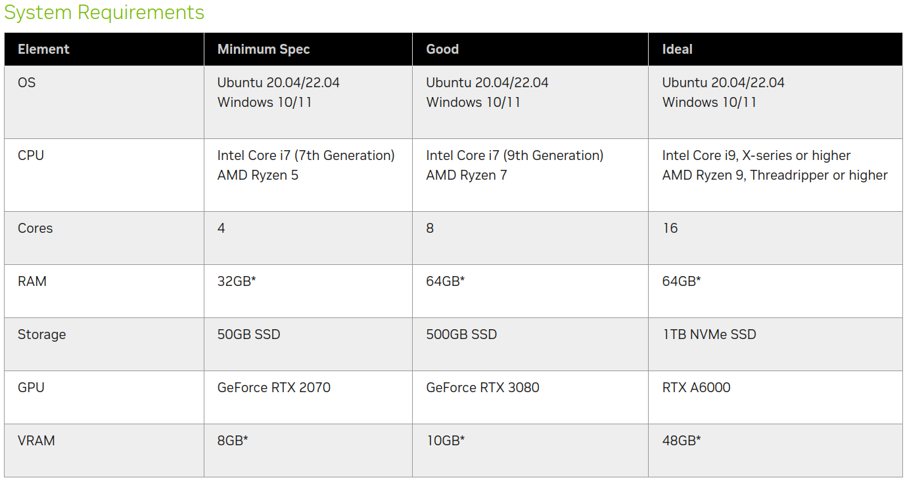
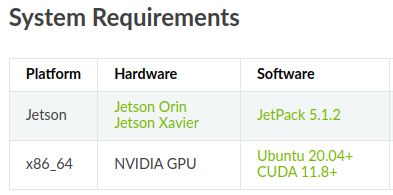
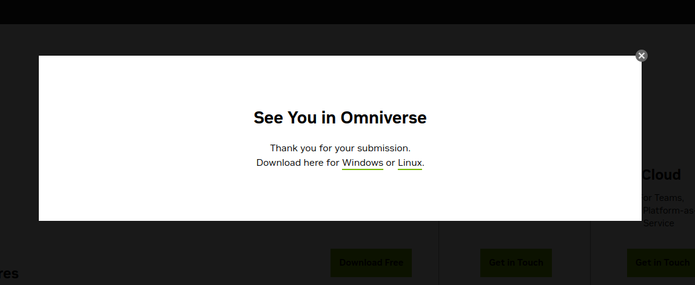

# FAQ

## High-level questions

### :fontawesome-solid-circle-question: What is the requirement to run Isaac Sim?

### :fontawesome-solid-circle-question: What is the requirement to run Isaac ROS?

### :fontawesome-solid-circle-question: Can Jetson run Isaac SIM?

Short answer: No.

### :fontawesome-solid-circle-question: Can I run Isaac SIM on my Windows PC?

Yes, you can run Isaac Sim on your Windows PC. To begin downloading Isaac Sim, the first step is to [download Omniverse](https://www.nvidia.com/en-us/omniverse/download/) on your system. When doing so, ensure to select the Windows version as depicted in the image below:

### :fontawesome-solid-circle-question: Can I (re-)run this lab with Windows PC to run Isaac SIM?

Yes, you can replicate the same instructions on your Windows machine, and you should achieve identical results.

### :fontawesome-solid-circle-question: What is the minimum system requirement for running Isaac SIM?

answer answer

### :fontawesome-solid-circle-question: What are the performance numbers running Isaac ROS packages?

[Performance Summary — isaac_ros_docs documentation](https://nvidia-isaac-ros.github.io/performance/index.html)

### :fontawesome-solid-circle-question: What’s the best way to post questions?

1. [Isaac ROS Developer forum](https://forums.developer.nvidia.com/c/agx-autonomous-machines/isaac/isaac-ros/600)
2. [GitHub issues for each Repo](https://github.com/orgs/NVIDIA-ISAAC-ROS/repositories)

### :fontawesome-solid-circle-question: Can Isaac ROS run on Jetson Orin Nano?

Yes, it can. However, your performance may vary compared to that of Jetson AGX Orin.

## Technical questions

### :fontawesome-solid-circle-question: How can I accelerate my standard ROS 2 node using Isaac ROS? 

1. [NITROS](https://nvidia-isaac-ros.github.io/concepts/nitros/index.html)
2. [Yolov8 sample](https://nvidia-isaac-ros.github.io/repositories_and_packages/isaac_ros_object_detection/isaac_ros_yolov8/index.html#quickstart)

### :fontawesome-solid-circle-question: How do I integrate Nvblox into my NAV stack?

As a local costmap provider. See [nvblox_nav2_costmap_provider](https://github.com/NVIDIA-ISAAC-ROS/isaac_ros_nvblox/blob/main/nvblox_nav2/src/nvblox_costmap_layer.cpp)

### :fontawesome-solid-circle-question: What the difference between cuVSLAM vs Nvblox?

cuVSLAM is a visual odometry/visual SLAM tool designed for localization purposes. It works in tandem with Nvblox, which constructs a 3D representation of the environment and utilizes cuVSLAM to determine its position. Moreover, Nvblox facilitates obstacle mapping. cuVSLAM, on the other hand, constructs an internal localization map.

### :fontawesome-solid-circle-question: How do I render an Nvblox-generated 3D mesh on Foxglove?

[Foxglove Nvblox plugin](https://github.com/NVIDIA-ISAAC-ROS/isaac_ros_nvblox/tree/release-3.0-prerelease/nvblox_foxglove).

### :fontawesome-solid-circle-question: Does Nvblox generate the global and/or local costmap?

Local costmap. It can theoretically be used to create a global costmap but that would be memory intensive to create a ESDF/voxel map and then extract a 2D costmap from it.

### :fontawesome-solid-circle-question: Is there a planer constraint for the Nvblox?

No.

### :fontawesome-solid-circle-question: What are the parameters for Nvblox?

Nvblox parameters [here](https://www.google.com/url?q=https://nvidia-isaac-ros.github.io/repositories_and_packages/isaac_ros_nvblox/isaac_ros_nvblox/index.html%23api&sa=D&source=docs&ust=1710558497690213&usg=AOvVaw0swOKLgJcyEbvIo3ghhyLl).

### :fontawesome-solid-circle-question: Biggest area that Nvblox can map?

Memory consumption is the primary limiting factor. For 2D ESDF output (such as ground robot navigation), the dominant memory consumer is the 3D TSDF, which requires 2 bytes per voxel. At a voxel size of 5cm, this amounts to 64Kb per cubic meter. While the Orin can support up to 64Gb of memory, it's advisable not to allocate all of it to the map. Assuming 16Gb for the map, this translates to around 250,000 cubic meters, covering approximately 80,000 square meters of floor area with 3-meter-high ceilings, roughly equivalent to a small warehouse. However, this analysis disregards memory allocation only within observed space, likely doubling the estimated figure. Currently, nvblox is primarily intended for local mapping. In an upcoming release, default settings will include voxel decay and map cropping beyond the robot's vicinity to restrict map growth.

### :fontawesome-solid-circle-question: How often does the Nvblox mesh get refreshed?

It depends on the configurable parameter known as the window batch size.

### :fontawesome-solid-circle-question: Can I add a sensor on an existing robot in Isaac SIM?

Yes, [here](https://docs.omniverse.nvidia.com/isaacsim/latest/adding_sensors.html?highlight=sensor#adding-sensors) are the instructions

