# Hardware-in-Loop setup

Isaac Sim can be used to run and test the ROS2 applications. There are two ways we can configure the system.

- Software in the Loop
- Hardware in the Loop

**Software in the Loop (SIL)** refers to a configuration where the software being tested is not running on the target hardware platform. For example, Isaac ROS packages being tested on x86 before deployment on a Jetson device is SIL.

**Hardware in the Loop (HIL)** refers to a configuration where the software is being tested on the target hardware platform. For example, Isaac ROS packages being tested on a Jetson device before deployment is HIL.

## Exercise 1. Verify the basic communication 

We will use ROS 2 to communicate robot information between Jetson and PC.

!!! info 

    For optimal and reliable data communication between Jetson and PC, it is generally ideal to use a wired Ethernet to foam a robust network connection, especially on a moving platform like a robot.

    However for the ease of setup in this lab, Jetson and PC are connected via a USB (Type-A end on PC and USB-C end on Jetson) cable, to form a peer-to-peer, local closed network.

    Jetson, when connected as a device, presents a USB communication device class (CDC) among other classes, effectively forming an "Ethernet over USB" connection between the Jetson and the host PC.

    Jetson assigns the IP address `192.168.55.1` to itself and assign `192.168.55.100` to the host side device, so conveniently Jetson is always reachable by the IP address from the host.

    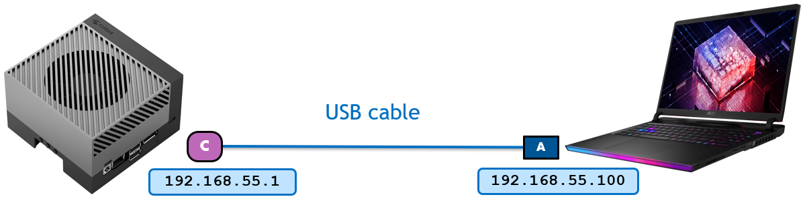

    This closed network also helps to accommodate multiple ROS 2 systems in a same room, eliminating the needs of setting different `ROS_DOMAIN_ID`.

Let's check the IP address on both Jetson and PC to first verify that they can ping each other. 

1. Ensure that both the Jetson and PC are connected on the same network. 

    !!! info 
        
        In the case of our lab, they are foaming a peer-to-peer style local network over the USB Type-A to USB-C cable.

2. Check the IP address of each device by using `ip addr` command on both Jetson and PC, and test if it can reach each other by using `ping` command.

    ```bash
    ip addr
    ping <other_device_ip>
    ```

## Exercise 2. Verify the ROS 2 communication 

### :material-laptop:{ .ubuntupurple } On PC, start simulation 

1. Open the following file path in Isaac Sim

    ```
    /home/nvidia/Desktop/Isaac_ROS_Isaac_SIM_[DLIT61534]/Isaac Sim Assets Pack 1/Assets/Isaac/2023.1.1/Isaac/Environments/Simple_Warehouse/course_env_5.usd
    ```

    or navigate to the environment you have created so far in Isaac Sim.

2. Initiate the simulation in Isaac Sim by clicking the "**Play**" button, activating both the graph and the physics engine.

### :material-developer-board:{ .nvgreen } On Jetson, remotely teleop the robot in Isaac Sim 

1. Launch the Isaac ROS dev container suing the `run_dev.sh` script:

    ```bash
    cd ${ISAAC_ROS_WS}/src/isaac_ros_common && \
    ./scripts/run_dev.sh ${ISAAC_ROS_WS} 
    ```

2. Once in the container, source the workspace

    ```bash
    source /workspaces/isaac_ros-dev/install/setup.bash
    ```

3. In the ROS-sourced terminal, check that the associated ROS topics exist.

    ```bash
    ros2 topic list
    ```

4. Send a twist message to cmd_vel topic

    ```bash
    ros2 topic pub /cmd_vel geometry_msgs/Twist '{linear:  {x: 0.2, y: 0.0, z: 0.0}, angular: {x: 0.0,y: 0.0,z: 0.0}}'
    ```

    !!! note

        You can also use `teleop_twist_keyboard` package to control the robot

## Exercise 3. Run HIL - Isaac Sim + Nvblox

Isaac ROS Nvblox provides ROS 2 packages for 3D reconstruction and navigation cost maps. It processes depth and pose data to create real-time 3D scene reconstructions and generates 2D costmaps for navigation, aiding in obstacle avoidance.

Compatible with depth cameras and/or 3D LiDAR, it utilizes GPU acceleration for efficient computation, leveraging the nvblox C++ library for reconstruction and costmap generation.

In a typical graph, `isaac_ros_nvblox` takes depth and color images along with pose data, computes a 3D scene reconstruction on the GPU, and generates an output cost map for navigation. Colorized 3D reconstruction updates can be visualized in RViz in real-time as well.

!!! Warning "Cheat-file"

    You can access a pre-populated environment at `/home/nvidia/Desktop/Isaac_ROS_Isaac_SIM_[DLIT61534]/Isaac Sim Assets Pack 1/Assets/Isaac/2023.1.1/Isaac/Environments/Simple_Warehouse/course_env_6.usd`


### Modify the robot's Action Graph :material-laptop:{ .ubuntupurple } 

#### Drive Action Graph

1. Right click on the `drive_actiongraph` and open the Graph

    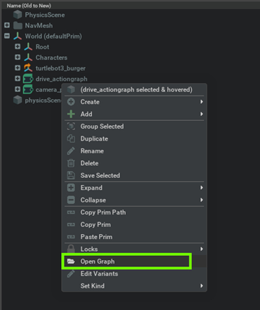

2. Search the relevant Nodes in the search bar and build the graph shown below just below the Drive action graph.

    Connect the Exec In for each node to the On Playback Tick Node (which you may have created earlier when setting up the drive action graph) for all nodes not shown in this image.

    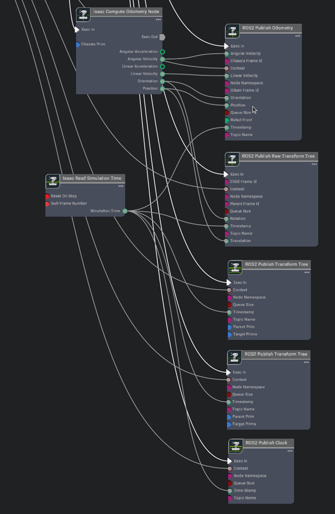

    #### Graph Explanation

    - [**On Playback Tick Node**](https://docs.omniverse.nvidia.com/extensions/latest/ext_omnigraph/node-library/nodes/omni-graph-action/onplaybacktick-1.html?highlight=On%20Playback%20Tick%20Node#on-playback-tick): Generates a tick during simulation playback, ensuring nodes execute their functions every simulation step.
    - [**Isaac Compute Odometry Node**](https://docs.omniverse.nvidia.com/extensions/latest/ext_omnigraph/node-library/nodes/omni-isaac-core_nodes/isaaccomputeodometry-1.html?highlight=isaac%20odom#isaac-compute-odometry-node): Holds values related to odometry
    - [**ROS2 Publish Raw Transform Tree**](https://docs.omniverse.nvidia.com/extensions/latest/ext_omnigraph/node-library/nodes/omni-isaac-ros2_bridge-humble/ros2publishrawtransformtree-1.html?highlight=ROS2%20Publish%20Raw%20Transform%20Tree#ros2-publish-raw-transform-tree): This node publishes a user-defined transformation between any two coordinate frames as a ROS2 Transform Tree
    - [**ROS2 Publish Transform Tree**](https://docs.omniverse.nvidia.com/extensions/latest/ext_omnigraph/node-library/nodes/omni-isaac-ros2_bridge-humble/ros2publishtransformtree-1.html?highlight=ROS2%20Publish%20Transform%20Tree#ros2-publish-transform-tree): This node publishes the pose of prims as a ROS2 Transform Tree
    - [**ROS2 Publish Odometry**](https://docs.omniverse.nvidia.com/extensions/latest/ext_omnigraph/node-library/nodes/omni-isaac-ros2_bridge-humble/ros2publishodometry-1.html?highlight=ROS2%20Publish%20Odometry#ros2-publish-odometry): This node publishes odometry as a ROS2 Odometry message
    - [**ROS2 Publish Clock**](https://docs.omniverse.nvidia.com/extensions/latest/ext_omnigraph/node-library/nodes/omni-isaac-ros2_bridge-humble/ros2publishclock-1.html?highlight=ROS2%20Publish%20Clock#ros2-publish-clock): This node publishes the given time as a ROS2 Clock message
    - [**Isaac Read Sim Time**](https://docs.omniverse.nvidia.com/extensions/latest/ext_omnigraph/node-library/nodes/omni-isaac-core_nodes/isaacreadsystemtime-1.html?highlight=Isaac%20Read%20Sim%20Time#isaac-read-system-time): Holds values related to system timestamps

3. Set the node properties

    1. Assign the chassisPrim to the base link of the robot to get the odometry reading using the **Isaac Compute Odometry Node**.

        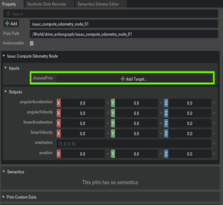
        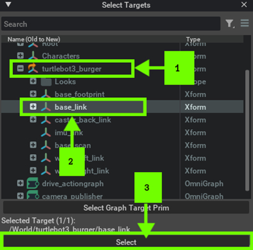
        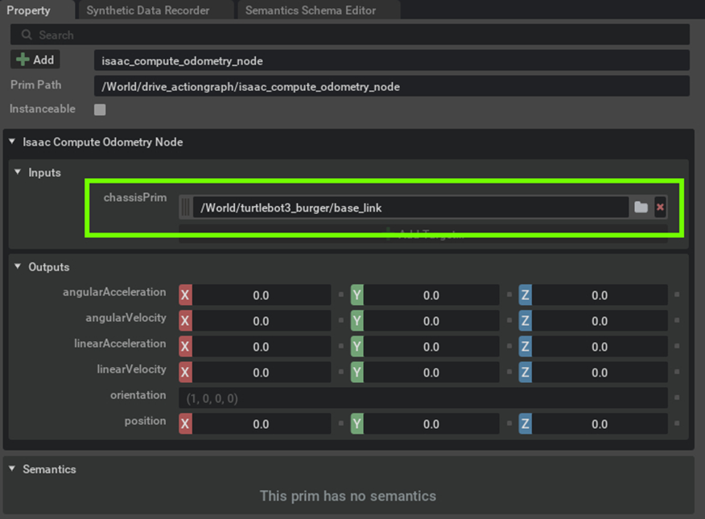

    2. [Optional] If your chassisprim is different from base_link then update the chassisFramId in the **ROS2 Publish Odometry Node**. In our example we do not need to change it.

        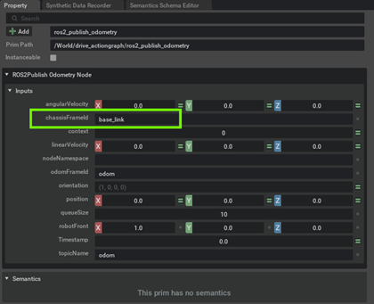

    3. [Optional] If your chassisprim is different from base_link then update the **ChildFramId** in the **ROS2 Publish Raw Transform Tree Node**. In our example we do not need to change it.

        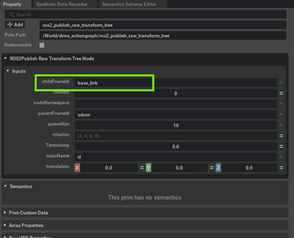

    4. Publish the base_link transform by selecting base_link as both parentPrim and targetPrim in the **ROS2 Publish Transform Tree Node**. How to assign a prim has already been shown in Step 3a above.

        

    5. Publish the base_link transform to both cameras by selecting base_link as parentPrim and `Camera_OmniVision_OV9782_Left` and `Camera_OmniVision_OV9782_Right` as targetPrims in the other** ROS2 Publish Transform Tree Node**. How to assign a prim has already been shown in the step above.

        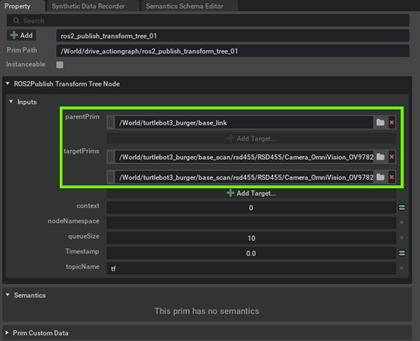

#### Camera Publisher Action Graph

1. Right click on the camera_publisher action graph and select "**Open Graph**"

    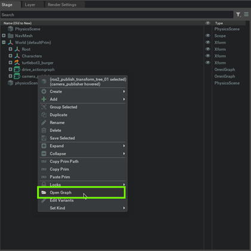

2. Search the relevant Nodes in the search bar and build the graph shown below just below the original camera publisher graph.

    We just need to add two more **ROS2 Camera Helper** nodes to publish the depth image from the camera.

    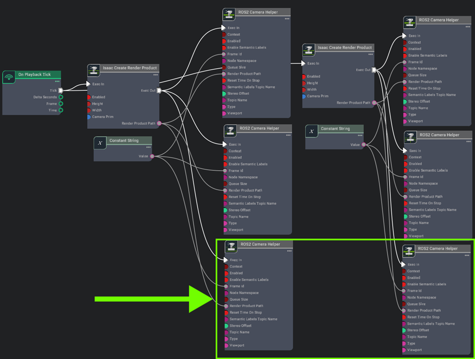

    #### Graph Explanation

    - [**ROS2 Camera Helper**](https://docs.omniverse.nvidia.com/extensions/latest/ext_omnigraph/node-library/nodes/omni-isaac-ros2_bridge-humble/ros2camerahelper-2.html?highlight=ROS2%20Camera%20Helper#ros2-camera-helper): This node handles automation of the camera sensor pipeline

3. Set the node properties

    1. Set the topicName and data type for the new ROS2 Camera Helper Nodes

        === "node 1"

            topicName : `/front/stereo_camera/left/depth`
            type : `depth`

            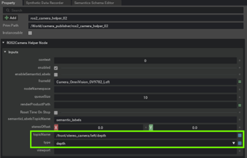

        === "node 2"

            topicName : `/front/stereo_camera/right/depth`
            type : `depth`

            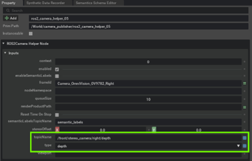

    2. Enable "**Reset Time on Stop**" for all the 6 ROS2 Camera Helper Nodes

        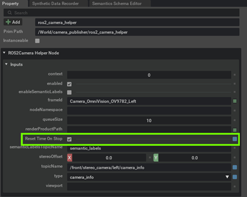

4. After making the specified modifications to the graphs, click the "**Play**" button to start the simulation.

### Launch Nvblox on Jetson :material-developer-board:{ .nvgreen } 

!!! note ""

    :fontawesome-solid-book:{ .book-blue-note } *Isaac ROS Official Documentation - [**Isaac ROS Nvblox**](https://nvidia-isaac-ros.github.io/repositories_and_packages/isaac_ros_nvblox/index.html)*

1. Ensure that you have established a ROS 2 workspace for experimenting with Isaac ROS, and set the `ISAAC_ROS_WS` environmental variable to point to your ROS 2 workspace directory, following the initial setup instructions for Isaac ROS previously mentioned - [Link](https://nvidia-isaac-ros.github.io/getting_started/dev_env_setup.html)

2. Launch the Docker container using the run_dev.sh script:

    ```bash
    cd ${ISAAC_ROS_WS}/src/isaac_ros_common && \
    ./scripts/run_dev.sh ${ISAAC_ROS_WS}
    ```

3. Once inside the container, source the workspace:

    ```bash
    source /workspaces/isaac_ros-dev/install/setup.bash
    ```

4. Launch the pre-composed graph launch file:

    ```bash
    ros2 launch nvblox_examples_bringup isaac_sim_example.launch.py
    ```

    This command will open an RViz window for visualizing the output.

    

5. Click the "**2D Goal Pose**" button in RViz and set a goal location and heading for your robot. You'll observe the mesh, costmap, and the robot navigating towards the goal.

    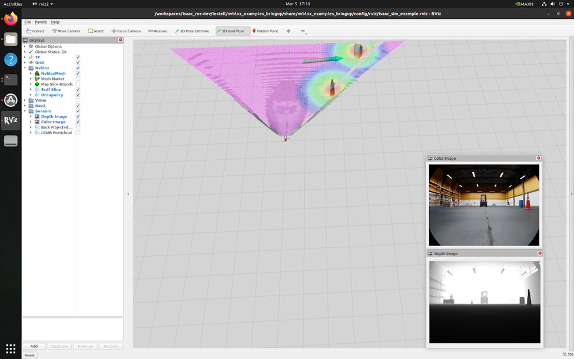

!!! tip

    If you see the robot moving very slowly then try to play with the **maxLinearSpeed** in **Speed Differential Controller Node**

    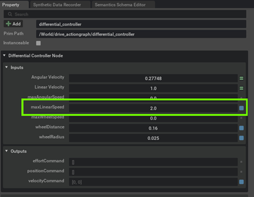

[Next](./nextgen-ai.md){ .md-button .md-button--primary }