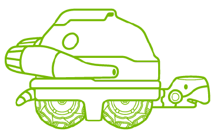
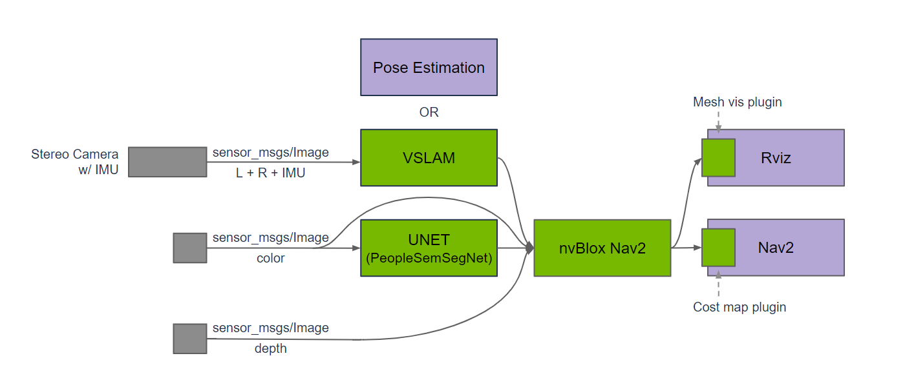

# Hands-on Session on Isaac ROS




## About Isaac ROS

!!! note ""

    :fontawesome-solid-book:{ .book-blue-note } *Official Isaac ROS Documentation - [**Getting Started**](https://nvidia-isaac-ros.github.io/getting_started/index.html)*

NVIDIA has developed the Isaac ROS suite to harness hardware acceleration on NVIDIA Jetson and discrete GPUs, enhancing standard robotics applications. It maintains standard ROS interfaces for input and output, facilitating seamless integration and user-friendliness as a direct replacement for traditional CPU-based ROS frameworks familiar to robotics developers.

### System Requirements

|Platform|Hardware|Software|
|-|-|-|
|Jetson|[Jetson Orin](https://www.nvidia.com/en-us/autonomous-machines/embedded-systems/jetson-orin/)<br>[Jetson Xavier](https://www.nvidia.com/en-us/autonomous-machines/embedded-systems/jetson-agx-xavier/)|[JetPack 5.1.2](https://developer.nvidia.com/embedded/jetpack)|
|x86_64|NVIDIA GPU|[Ubuntu 20.04](https://releases.ubuntu.com/20.04/)+<br>[CUDA 11.8](https://developer.nvidia.com/cuda-downloads)+|


All Isaac ROS packages are tested to be compatible with ROS 2 Humble. If your application is built with ROS 1, you can integrate it with Isaac ROS using the [NITROS Bridge](https://nvidia-isaac-ros.github.io/repositories_and_packages/isaac_ros_nitros_bridge/index.html).

### Lab setup

!!! info

    The following exercise assumes that the Jetson is set up by roughly following the Isaac ROS's setup procedures below.

    - [Hardware Setup / Computer Setup / Jetson Platforms](https://nvidia-isaac-ros.github.io/getting_started/hardware_setup/compute/index.html)
        - [Developer Environment Setup for Jetson](https://nvidia-isaac-ros.github.io/getting_started/hardware_setup/compute/jetson_storage.html) (NVMe installation)
    - [Developer Environment Setup](https://nvidia-isaac-ros.github.io/getting_started/dev_env_setup.html)

    For the detail on how the GTC lab provided Jetson units are configured, please check this [Jetson setup](./setup_jetson.md) page.

## Exercise 1. Run Isaac ROS dev container

!!! note ""

    :fontawesome-solid-book:{ .book-blue-note } *Official Isaac ROS Documentation - [**Isaac ROS Common**](https://nvidia-isaac-ros.github.io/repositories_and_packages/isaac_ros_common/index.html#isaac-ros-docker-development-environment)*

We strongly recommend setting up your developer environment using Isaac ROS Dev Docker images to streamline your development setup with the correct versions of dependencies on both Jetson and x86_64 platforms. All tutorials have been designed with these docker images as a prerequisite.

Before you begin, verify that your device has sufficient storage available. We recommend at least 30 GB, which likely necessitates an SSD if running on Jetson platforms.

!!! note

    For this exercise you will need two terminals open on the jetson and you can arrange them in the following manner

    


1. [ :simple-windowsterminal:{ .nvgreen } Terminal 1 ] Start the Isaac ROS dev container by executing a simple alias command 

    ```bash
    isaac-ros-container
    ```

    <!-- !!! tip
        After you type `isaac` in the terminal, just hit ++tab++ then the rest gets completed, so you just need to type ++enter++ after that to execute. -->

    ??? info "In case the alias command is not available"

        1. Ensure that you have established a ROS 2 workspace for experimenting with Isaac ROS, and set the `ISAAC_ROS_WS` environmental variable to point to your ROS 2 workspace directory, following the initial setup instructions for Isaac ROS previously mentioned - [Link](https://nvidia-isaac-ros.github.io/getting_started/dev_env_setup.html)

            ```bash
            echo $ISAAC_ROS_WS
            ```

        1. Launch the Docker container using the `run_dev.sh` script:

            ```bash
            cd ${ISAAC_ROS_WS}/src/isaac_ros_common && \
            ./scripts/run_dev.sh ${ISAAC_ROS_WS}
            ```

4. [ :simple-windowsterminal:{ .nvgreen } Terminal 1 ] Once in the Isaac ROS dev container, source the workspace:

    ```bash
    source /workspaces/isaac_ros-dev/install/setup.bash
    ```

5. [ :simple-windowsterminal:{ .nvdarkgreen } Terminal 2 ] When you need the 2nd terminal attached to the container, run the alias script again:

    ```bash
    isaac-ros-container
    ```

    Once in the Isaac ROS dev container, again source the workspace:

    ```bash
    source /workspaces/isaac_ros-dev/install/setup.bash
    ```

## Exercise 2. Run Isaac ROS Nvblox with Rosbag

!!! note ""

    :fontawesome-solid-book:{ .book-blue-note } *Official Isaac ROS Documentation - [**Isaac ROS Nvblox**](https://nvidia-isaac-ros.github.io/repositories_and_packages/isaac_ros_nvblox/index.html)*

### About Nvblox

Isaac ROS Nvblox contains ROS 2 packages for 3D reconstruction and cost maps for navigation. The Nvblox node processes depth and pose to reconstruct a 3D scene in real-time. It also outputs a 2D costmap for [Nav2](https://github.com/ros-planning/navigation2).



!!! note

    In this exercise, we will continue using the Terminal 1 and Terminal 2 set up in the above Exercise 1.<br>
    If you have not completed the exercise, follow the Exercise 1 to have them ready. 

1. [ :simple-windowsterminal:{ .nvgreen } Terminal 1 ]  Run the launch file for Nvblox with `nav2`

    ```bash
    ros2 launch nvblox_examples_bringup isaac_sim_example.launch.py
    ```

2. [ :simple-windowsterminal:{ .nvdarkgreen } Terminal 2 ] Playback the recorded rosbag

    Play the recorded rosbag file.

    ```bash
    ros2 bag play src/isaac_ros_nvblox/nvblox_ros/test/test_cases/rosbags/nvblox_pol
    ```

    RViz should start showing visualization like the following.

    

[Next](./hardware-in-loop.md){ .md-button .md-button--primary }