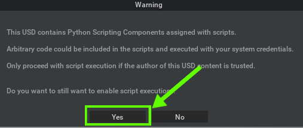
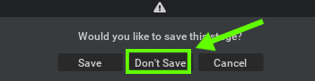

# Hands-on Session on Isaac Sim

## About Isaac Sim

!!! note ""

    :fontawesome-solid-book:{ .book-blue-note } *Official Isaac Sim Documentation - [Link](https://docs.omniverse.nvidia.com/isaacsim/latest/overview.html)*

NVIDIA Omniverse™ Isaac Sim is a robotics simulation toolkit on the NVIDIA Omniverse™ platform, offering tools for creating virtual robotic environments and experiments. It supports navigation, manipulation via ROS/ROS2, and simulates sensor data like RGB-D, Lidar, and IMU for computer vision applications, including domain randomization and ground-truth labeling.

!!! note

    Through out the following exercises, you may see this warning dialog when you open our pre-scripted USD file. 
    You can just press "**Yes**" to dismiss.

    

    Also, when you close the USD file, press "**Don't Save**" so that you get to re-use the provided USD files in the way later.

    

## Exercise composition

Hands-on session on Isaac Sim is composed of 5 exercises.

Some exercises are designed to be built upon the result of previous exercise.  However we provide a pre-configured USD file at each exercise completion, so you can skip some exercise.

### Exercise 1.1 Launch Isaac Sim [==Hands-on==]

We introduce two ways to launch Isaac Sim.

[:fontawesome-solid-circle-arrow-right: Go to the exercise](./isaac-sim_01.md) 

### Exercise 1.2 Create an Environment in Isaac Sim [==Hands-on==]

We learn how we can build an environment from scratch using primitives in Isaac Sim as well as using pre-created assets. 

[:fontawesome-solid-circle-arrow-right: Go to the exercise](./isaac-sim_02.md) 

### Exercise 1.3 Load Assets in Isaac Sim.

We will learn

- How to add props/assets, place and move them, and view the environment from desired perspectives [==Hands-on==]
- How to add people in an environment using `omni.anim.people` extension
- How to add a robot in the scene using the URDF file
- How to attach a camera to the robot

[:fontawesome-solid-circle-arrow-right: Go to the exercise](./isaac-sim_03.md) 

### Exercise 1.4 Build Action Graph to drive a robot

We will learn how to construct an Action Graph for driving a robot in the simulator from ROS 2 side.

[:fontawesome-solid-circle-arrow-right: Go to the exercise](./isaac-sim_04.md) 

### Exercise 1.5 Build Action Graph for robot camera

We will learn how to construct an Action Graph for publishing robot camera images to ROS 2 side.

[:fontawesome-solid-circle-arrow-right: Go to the exercise](./isaac-sim_05.md) 
