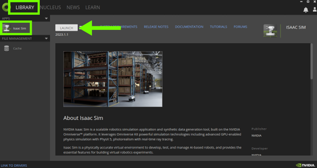
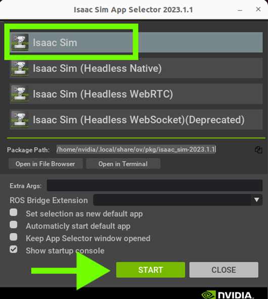

# Exercise 1.1 Launch Isaac Sim

!!! note ""

    :fontawesome-solid-book:{ .book-blue-note } *Documentation - [Link](https://docs.omniverse.nvidia.com/isaacsim/latest/installation/install_workstation.html#isaac-sim-setup-native-workstation-launcher)*

!!! info 

    ### PC setup before the lab

    Please check "[PC setup](../setup_pc.md)" page to check how the Linux PC is set up prior to the course offering. 

=== "GUI" 

    1. Open Omniverse Launcher
    2. Navigate to the **LIBRARY** tab, choose **Isaac Sim** from the sidebar, and click **Launch** to open Isaac Sim App Selector.
        
    3. Click START to run the Isaac Sim main app.
        

=== "Terminal (CUI)"

    1. Open a terminal ( ++ctrl+alt+t++ )
    2. Type the following and hit ++enter++.

        ```bash
        ~/.local/share/ov/pkg/isaac_sim-2023.1.1/isaac-sim.sh -v
        ```
[Next](./isaac-sim_02.md){ .md-button .md-button--primary }
