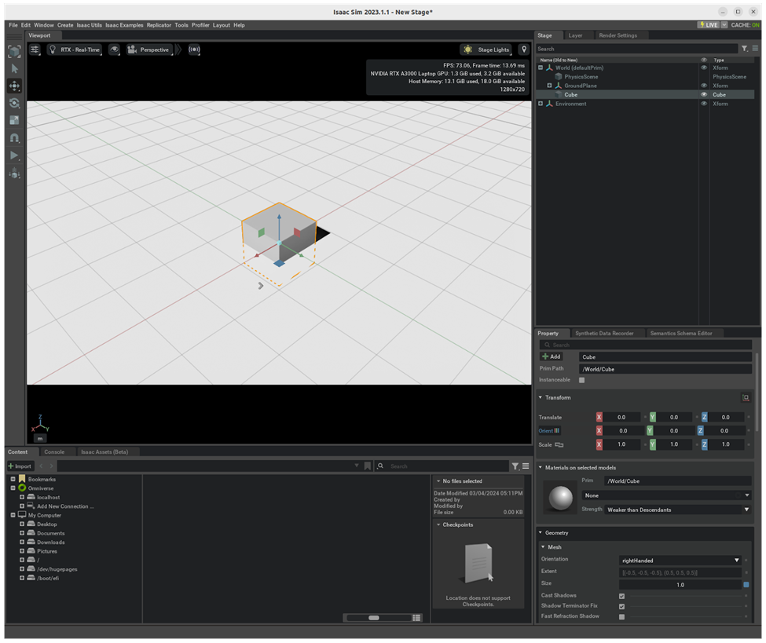
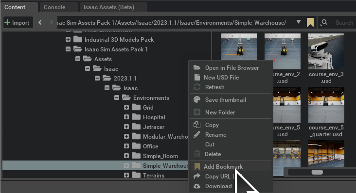
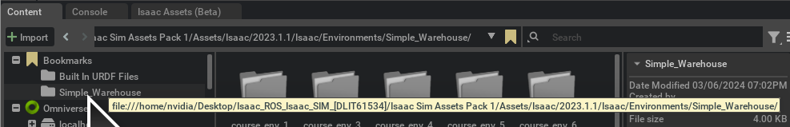
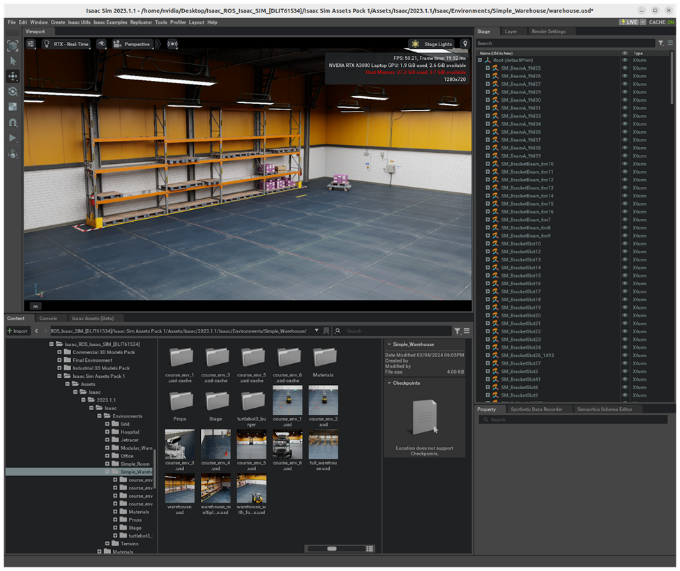

# Exercise 1.2 Create an Environment in Isaac Sim

!!! note ""

    :fontawesome-solid-book:{ .book-blue-note } *Documentation - [Link](https://docs.omniverse.nvidia.com/isaacsim/latest/gui_tutorials/tutorial_intro_environment_setup.html#environment-setup)*

=== "With a simple plane ground"

    ### Create an environment with a simple plane ground

    1. Select "**Create**" in the Menu Bar, then choose "**Physics**" > "**Physics Scene**" to add it to the stage tree. Check its properties to see gravity set at `-Z` with a magnitude of 9.8
    2. Click "**Create**" in the Menu Bar, then choose "**Physics**" > "**Ground Plane**."
    3. Click "**Create**" in the Menu Bar, then select "**Shapes**" > "**Cube**."
    4. Select the Cube, then in the Property tab, click the + Add button and choose "**Physics**" > "**Rigid Body**" with **Colliders Preset**.

    

    !!! tip

        How to navigate in the Viewport

        - Mouse Right-click and drag to tilt/pan
        - Mouse Right-click and ++w++ ++a++ ++s++ ++d++ to move forward/left/back/right, ++q++ ++e++ to move up/down
        - Copy an object position by going to "Transform" tab
    [Next](./isaac-sim_03.md){ .md-button .md-button--primary }

=== "With Isaac Sim Assets"

    ### Create an environment with Isaac Sim Assets

    !!! info "Prepare asset packs for course"

        Unzip the asset packs prepared for this course and save it under Desktop.

        ```bash
        cd ${HOME}
        ls -lh Isaac_ROS_Isaac_SIM_\[DLIT61534\].zip
        unzip Isaac_ROS_Isaac_SIM_\[DLIT61534\].zip -d ${HOME}/Desktop
        export COURSE_DIR=/home/nvidia/Desktop/Isaac_ROS_Isaac_SIM_\[DLIT61534\]
        ```

        <!-- Later in this document, we will refer this "**`Isaac_ROS_Isaac_SIM_[DLIT61534]`**" directory under Desktop as **`/home/nvidia/Desktop/Isaac_ROS_Isaac_SIM_[DLIT61534]`**. -->

    1. Go to the **Content** tab in Isaac Sim
    2. Navigate to `/home/nvidia/Desktop/Isaac_ROS_Isaac_SIM_[DLIT61534]/Isaac Sim Assets Pack 1/Assets/Isaac/2023.1.1/Isaac/Environments/`
    3. Select the environment you want to work in.<br>In our case we will be working with `Simple_Warehouse/warehouse.usd`
   
        !!! tip

            We will be accessing this `Simple_warehouse` directory often through out this course, so it's a good idea to **Add Bookmark** this directory.

            

            Once you do this, you can easily access from the **Bookmarks**.

            

    An environment set up like this should appear.

    
    !!! tip

        How to navigate in the Viewport

        - Mouse Right-click and drag to tilt/pan
        - Mouse Right-click and ++w++ ++a++ ++s++ ++d++ to move forward/left/back/right, ++q++ ++e++ to move up/down
        - Copy an object position by going to "Transform" tab
    [Next](./isaac-sim_03.md){ .md-button .md-button--primary }

!!! info

    If you find yourself lost in the stage, just click on an item in the **Stage** tab, a press ++f++ to focus on it.

    