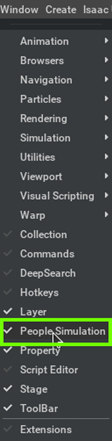

# Exercise 1.3 Load Assets in Isaac Sim

!!! note ""

    :fontawesome-solid-book:{ .book-blue-note } *Documentation - [Link](https://docs.omniverse.nvidia.com/isaacsim/latest/features/environment_setup/assets/index.html#isaac-sim-assets)*

!!! info "Prepare asset packs for course"

    Unzip the asset packs prepared for this course and save it under Desktop.

    ```bash
    cd ${HOME}
    ls -lh Isaac_ROS_Isaac_SIM_\[DLIT61534\].zip
    unzip Isaac_ROS_Isaac_SIM_\[DLIT61534\].zip -d ${HOME}/Desktop
    export COURSE_DIR=/home/nvidia/Desktop/Isaac_ROS_Isaac_SIM_\[DLIT61534\]
    ```

    Later in this document, we will refer this "**`Isaac_ROS_Isaac_SIM_[DLIT61534]`**" directory under Desktop as **`/home/nvidia/Desktop/Isaac_ROS_Isaac_SIM_[DLIT61534]`**.

## 1.3a. Add Props/Assets

1. Go to the **Content** tab in Isaac Sim
2. Go to `/home/nvidia/Desktop/Isaac_ROS_Isaac_SIM_[DLIT61534]/Isaac Sim Assets Pack 1/Assets/Isaac/2023.1.1/Isaac/Props/`

     | Asset Location | Asset Class |
     |----------------|-------------|
     |`/home/nvidia/Desktop/Isaac_ROS_Isaac_SIM_[DLIT61534]/Isaac Sim Assets Pack 1/Assets/Isaac/2023.1.1/Isaac/Props/`|Warehouse Essentials: (Factory, Forklift, Pallet, Dolly...)|
     |`/home/nvidia/Desktop/Isaac_ROS_Isaac_SIM_[DLIT61534]/Commercial 3D Models Pack/Assets/ArchVis/Commercial/`|Commercial Assets: (Chair, Table, Racks, Sofa...)|
     |`/home/nvidia/Desktop/Isaac_ROS_Isaac_SIM_[DLIT61534]/Isaac Sim Assets Pack 3/Assets/Isaac/2023.1.1/NVIDIA/Assets/ArchVis/Residential/`|Residential Necessities: (Kitchen Items, Furniture, Food...)|
     
3. Drag and drop the assets into the scene

    

    !!! tip

        How to navigate in the Viewport

        - Mouse Right-click and drag to tilt/pan
        - Mouse Right-click and ++w++ ++a++ ++s++ ++d++ to move forward/left/back/right, ++q++ ++e++ to move up/down
        - Copy an object position by going to "Transform" tab


4. Select the assets, then in the Property tab, click the + Add button and choose **Physics** > **Rigid Body** with **Colliders Preset**

!!! Warning "How to move the Asset"

    If you want to move the asset around, always select the asset from the stage and then use the arrows shown on the viewport to move the asset in X,Y or Z direction

    
!!! info

    If you plan to continue working on the later exercise using the environment you have been working on, save the environment file by selecting **File** > **Save As...** or ++ctrl+shift+s++. 

    

??? Warning "Cheat-file (course_env_1.usd)"

    You can access a pre-populated environment at `/home/nvidia/Desktop/Isaac_ROS_Isaac_SIM_[DLIT61534]/Isaac Sim Assets Pack 1/Assets/Isaac/2023.1.1/Isaac/Environments/Simple_Warehouse/course_env_1.usd`

    

## 1.3b. Add People

!!! note ""

    :fontawesome-solid-book:{ .book-blue-note } *Documentation - [Link](https://docs.omniverse.nvidia.com/isaacsim/latest/features/warehouse_logistics/ext_omni_anim_people.html#omni-anim-people)*

!!! Warning "Cheat-file (course_env_2.usd)"

    You can access a pre-populated environment at `/home/nvidia/Desktop/Isaac_ROS_Isaac_SIM_[DLIT61534]/Isaac Sim Assets Pack 1/Assets/Isaac/2023.1.1/Isaac/Environments/Simple_Warehouse/course_env_2.usd`

    

    !!! note

        When you open these cheat environment files, a pop up window may show up. Press "**Yes**".

        

1. Load the environment needed for the simulation.<br>
   Make sure the parent prim **/World** exists, if not create the prim **/World**.

    !!! info

        For the GTC lab, you can load the cheat-file below, `/home/nvidia/Desktop/Isaac_ROS_Isaac_SIM_[DLIT61534]/Isaac Sim Assets Pack 1/Assets/Isaac/2023.1.1/Isaac/Environments/Simple_Warehouse/course_env_2.usd`.

2. Open the extension manager via Window > Extensions. Search for "people" and enable the omni.anim.people extension.

    

    !!! tip

        Check "**AUTOLOAD**" to enable this extension by default.<br>
        It will come handy when you need to restart Isaac Sim frequently.

3. Load the **People Simulation** UI by navigating to **Window** > **People Simulation**.

    

4. Copy this text in the **Command Text Box**. [Place the people in according to your environment] 

    ```text
    Spawn Tom -6 0 0 0
    Spawn Jerry 3 10 0 0
    Tom GoTo -6 12 0 _
    Jerry GoTo 3 -3 0 _
    ```

5. Click the Load Characters button to load the characters assets and animations 

6. Next, click on the **Setup Characters** button to attach **Behavior Scripts** and **Animation Graph** to the characters.

    

    !!! note

        If you get a login screen on a course supplied PC, then add the following credentials:

        - Username : `admin`
        - Password : `admin`

        

    !!! abstract "In case parent prim **World** does not exist"

        1. In the Stage tab, Right-click the **Root** prim and choose "**Clear Default Prim**."

           

        2. In the Stage tab, Right-click and select **Create** > **Xform**.

           

        3. In the Stage tab, rename Xform to **World** by double-clicking it and editing the name.

           

        4. In the **Stage** tab, rename **Root** prim to Warehouse by double-clicking it and editing the name.
      
           

        5. Drag the **Warehouse** prim into the **World** prim.

           

        6. Right-click the **World** prim and select "**Set as Default Prim**."

           

7. Next, turn off the **Navmesh Based Navigation** setting and click **Play** to run the simulation.

    

    !!! note

        To further customize the people simulation, explore this [link](https://docs.omniverse.nvidia.com/isaacsim/latest/features/warehouse_logistics/ext_omni_anim_people.html#setup-simulation-from-scratch).

!!! info

    If you plan to continue working on the later exercise using the environment you have been working on, save the environment file by selecting **File** > **Save As...** or ++ctrl+shift+s++. 


## 1.3c. Add a Robot

!!! info

    On the course supplied PC, we've already cloned the Turtlebot description package using the following command:

    ```bash
    cd /home/nvidia/Desktop/Isaac_ROS_Isaac_SIM_[DLIT61534]
    git clone -b humble-devel https://github.com/ROBOTIS-GIT/turtlebot3.git turtlebot3
    ```

1. Open the URDF importer Isaac Utils > Workflows > URDF Importer.

    

2. In the prompt window, under Import Options, make sure "Clear Stage" is deselected to keep the current environment, uncheck "Fix Base Link" for mobility, and switch "Joint Drive Type" to Velocity.

    

3. In the **Import** section, select the URDF file in the **Input File** and **Output File**. 

    - Input File location of the URDF file for turtlebot:
  
        `/home/nvidia/Desktop/Isaac_ROS_Isaac_SIM_[DLIT61534]/turtlebot3/turtlebot3_description/urdf/turtlebot3_burger.urdf`

    - Output File location:
  
        `/home/nvidia/Desktop/Isaac_ROS_Isaac_SIM_[DLIT61534]/Isaac Sim Assets Pack 1/Assets/Isaac/2023.1.1/Isaac/Environments/

4. Ensure nothing is selected on the stage by clicking an empty space in the Stage tab or selecting **/World** in the tree.

    

5. Click **Import** to proceed and place the robot according to your environment.

    

    !!! note

        You may encounter this confirmation dialog, if you already have the `turtlebot3_burger.usd` in the output folder mentioned above.

        

    

## 1.3d. Attach a camera to the robot

!!! Warning "Cheat-file (course_env_3.usd)"

    You can access a pre-populated environment at `/home/nvidia/Desktop/Isaac_ROS_Isaac_SIM_[DLIT61534]/Isaac Sim Assets Pack 1/Assets/Isaac/2023.1.1/Isaac/Environments/Simple_Warehouse/course_env_3.usd`

    

1. Go to `/home/nvidia/Desktop/Isaac_ROS_Isaac_SIM_[DLIT61534]/Isaac Sim Assets Pack 1/Assets/Isaac/2023.1.1/Isaac/Sensors/Intel/RealSense/`

2. Drag and drop the `rsd455.usd` in the viewport.

    

3. Drag the rsd455 prim into the `/World/turtlebot3_burger/base_scan` prim 

    

4. Adjust the camera placement according to the robot's position.

    
    
    !!! tip

        Moving an object to a certain location:
        
        - Copy an object position by going to "Transform" tab

5. Change the **Viewport** camera to Realsense by selecting the **Camera** icon on the viewport, then navigating to **Camera** -> **Camera_OmniVision_OV9782_Color**.

    

!!! info

    If you plan to continue working on the later exercise using the environment you have been working on, save the environment file by selecting **File** > **Save As...** or ++ctrl+shift+s++. 
[Next](./isaac-sim_04.md){ .md-button .md-button--primary }
