# Exercise 1.4 Build Action Graph to drive a robot

!!! note ""

    :fontawesome-solid-book:{ .book-blue-note } *Documentation - [Link](https://docs.omniverse.nvidia.com/isaacsim/latest/ros2_tutorials/tutorial_ros2_drive_turtlebot.html#putting-it-together)*

!!! question ""

    ## OmniGraph

    !!! note ""

        :fontawesome-solid-book:{ .book-blue-note } *Documentation - [Link](https://docs.omniverse.nvidia.com/isaacsim/latest/gui_tutorials/tutorial_gui_omnigraph.html#omnigraph)*

    OmniGraph is Omniverse's visual programming tool, enabling easy function integration from various systems and supporting custom nodes for personalized functionality, leveraging Omniverse's efficient computation. In Omniverse Isaac Sim, it powers Replicators, ROS bridges, sensor integration, and more, serving as a crucial component. This tutorial offers a quick introduction to OmniGraph, with a recommendation to explore the detailed documentation for a comprehensive understanding.  

!!! Warning "Cheat-file (course_env_4.usd)"

    You can access a pre-populated environment at `/home/nvidia/Desktop/Isaac_ROS_Isaac_SIM_[DLIT61534]/Isaac Sim Assets Pack 1/Assets/Isaac/2023.1.1/Isaac/Environments/Simple_Warehouse/course_env_4.usd`

    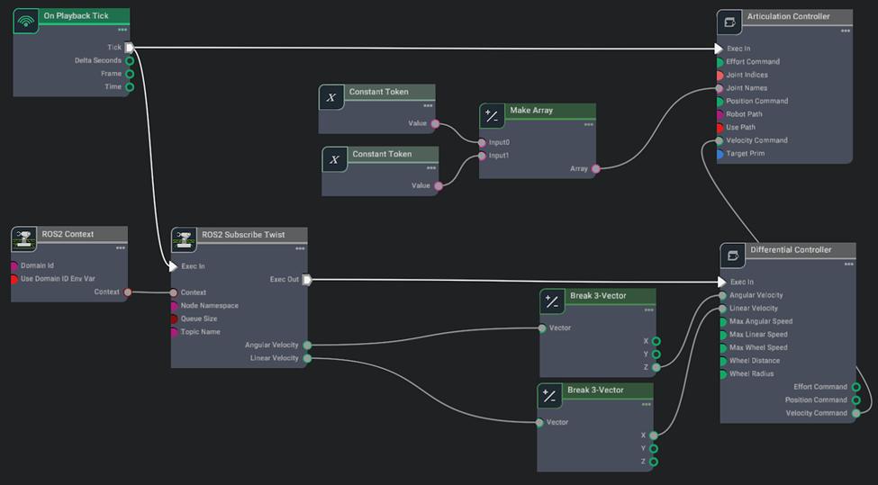
!!! tip

    How to navigate in the Visual Scripting graph editor:

    - Middle Mouse Button and drag to pan the editor view left, right, up, and down
    - Mouse Wheel to zoom toward or away from nodes in the editor

## Step 1. Open Visual Scripting

Go to **Window** > **Visual Scripting** > **Action Graph**.

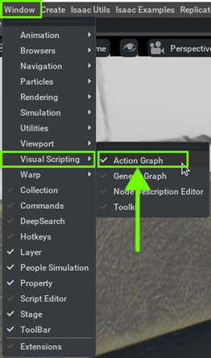

## Step 2. Create new Action Graph

Click on the **New Action Graph** icon in the middle of the **Action Graph** window.
   


## Step 3. Build graph

Search the relevant nodes in the search bar and build the graph shown below.


### Action Graph nodes

- [**On Playback Tick Node**](https://docs.omniverse.nvidia.com/extensions/latest/ext_omnigraph/node-library/nodes/omni-graph-action/onplaybacktick-1.html?highlight=On%20Playback%20Tick%20Node#on-playback-tick): Generates a tick during simulation playback, ensuring nodes execute their functions every simulation step.
- [**ROS2 Context Node**](https://docs.omniverse.nvidia.com/extensions/latest/ext_omnigraph/node-library/nodes/omni-isaac-ros2_bridge-humble/ros2context-2.html?highlight=ROS2%20Context%20Node#ros2-context): Establishes a context with a specified Domain ID for ROS2 communication. It can import the ROS_DOMAIN_ID from the environment if enabled.
- [**ROS2 Subscribe Twist Node**](https://docs.omniverse.nvidia.com/extensions/latest/ext_omnigraph/node-library/nodes/omni-isaac-ros2_bridge-humble/ros2subscribetwist-1.html?highlight=ROS2%20Subscribe%20Twist%20Node#ros2-subscribe-twist): Subscribes to Twist messages, typically used for controlling robotic motion. It triggers the Differential Node to calculate differential commands when a new Twist message is received.
- [**Break 3-Vector Node**](https://docs.omniverse.nvidia.com/extensions/latest/ext_omnigraph/node-library/nodes/omni-graph-nodes/breakvector3-1.html?highlight=Break%203%20Vector%20Node#break-3-vector): Decomposes 3-dimensional vectors (such as linear and angular velocities from Twist messages) into individual components before feeding them into the Differential Controller node.
     - [Twist message type](https://docs.ros.org/en/noetic/api/geometry_msgs/html/msg/Twist.html)
- [**Differential Controller Node**](https://docs.omniverse.nvidia.com/extensions/latest/ext_omnigraph/node-library/nodes/omni-isaac-wheeled_robots/differentialcontroller-1.html?highlight=Differential%20Controller%20Node#differential-controller): Receives desired vehicle speed and computes wheel speed based on wheel radius, wheel distance, and maximum linear speed parameters. It ensures proper motion control for the robot.
- [**Articulation Controller Node**](https://docs.omniverse.nvidia.com/extensions/latest/ext_omnigraph/node-library/nodes/omni-isaac-core_nodes/isaacarticulationcontroller-1.html?highlight=Articulation%20Controller%20Node#articulation-controller): Moves specified joints of the target robot using commands such as Position, Velocity, or Effort commands. It's often configured to control the movement of a robot's joints.
- [**Constant Token Node**](https://docs.omniverse.nvidia.com/extensions/latest/ext_omnigraph/node-library/nodes/omni-graph-nodes/constanttoken-1.html#constanttoken): Constant Token nodes are used to input the names of wheel joints, which are then combined into an array using a Make Array node. This array is used by the Articulation Controller node to control the robot's joints.

## Step 4. Set the node properties

1. [Optional] Assign ROS DOMAIN ID if needed using **ROS2 Context Node**.

    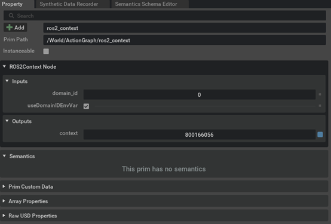

2. Specify the **topicName** (`cmd_vel`) to publish the ROS twist commands using the **ROS2 Subscribe Twist Node**.

    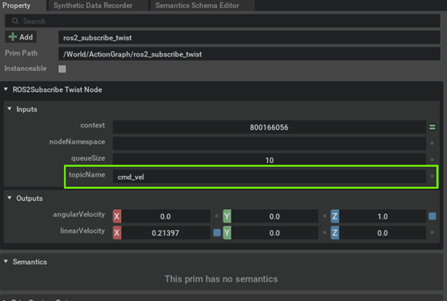

3. Specify the names of the wheel joints inside each of the **Constant Token Nodes** 

    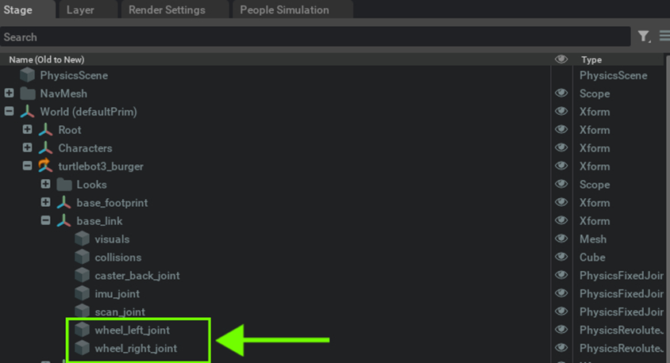
    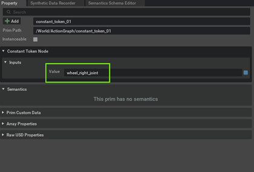
    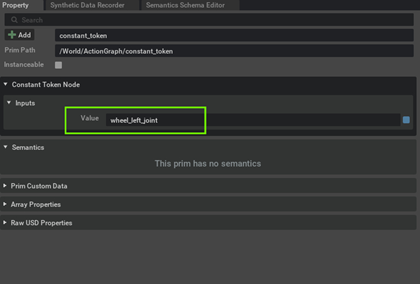

1. In the **Differential Controller** node's property tab, input the **wheel radius**, **wheel distance**, and **maximum linear speed** to match the Turtlebot specifications.

    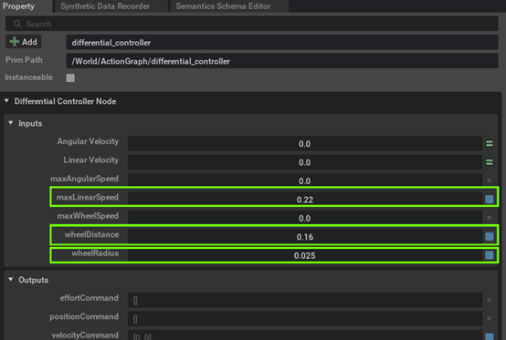

1. Assign the **Articulation Controller** node's target to be the Turtlebot

    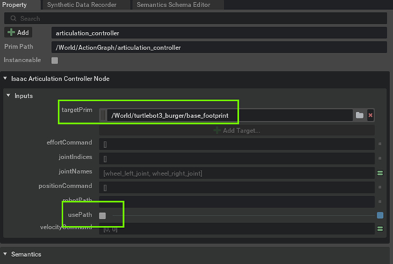


!!! info

    If you plan to continue working on the later exercise using the environment you have been working on, save the environment file by selecting **File** > **Save As...** or ++ctrl+shift+s++. 
    

## Step 5. Play

Click "**Play**" icon

## Step 6. Verification

Verify the ActionGraph by controlling the robot from ROS 2 side.

=== "`teleop_twist_keyboard`"

    Open a terminal and source ros2 

    ```bash
    source /opt/ros/humble/setup.bash
    ```

    Control the Turtlebot using the keyboard with `teleop_twist_keyboard` package.

    ```bash
    ros2 run teleop_twist_keyboard teleop_twist_keyboard
    ```

    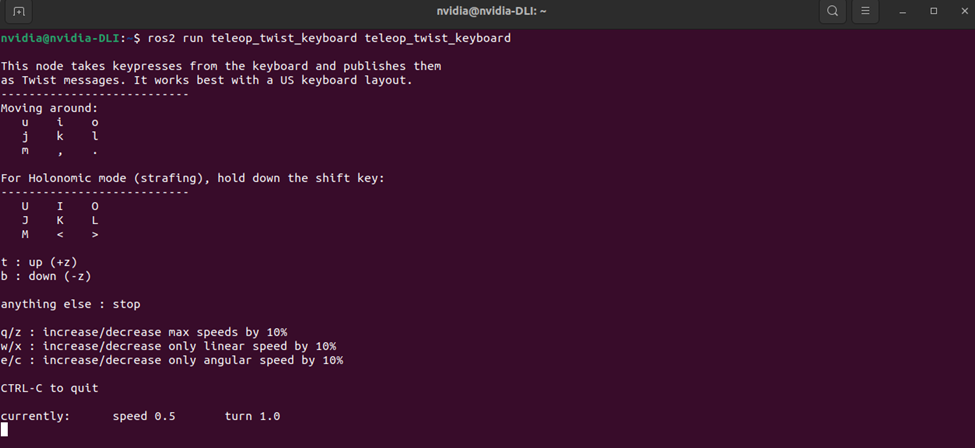

    <iframe src="https://drive.google.com/file/d/1W-RfxQDQeGI7JXvUP1OyhLiN-xNLpmBU/preview" width="960" height="480" allow="autoplay"></iframe>

    [Next](./isaac-sim_05.md){ .md-button .md-button--primary }

=== "Foxglove"
    
    1. Start the Foxglove Bridge

        ```bash
        ros2 launch foxglove_bridge foxglove_bridge_launch.xml
        ```

    2. Then start the Foxglove Studio from GUI or CUI.

        ```bash
        foxglove-studio
        ```

    3. Click on "**Open connection**"

        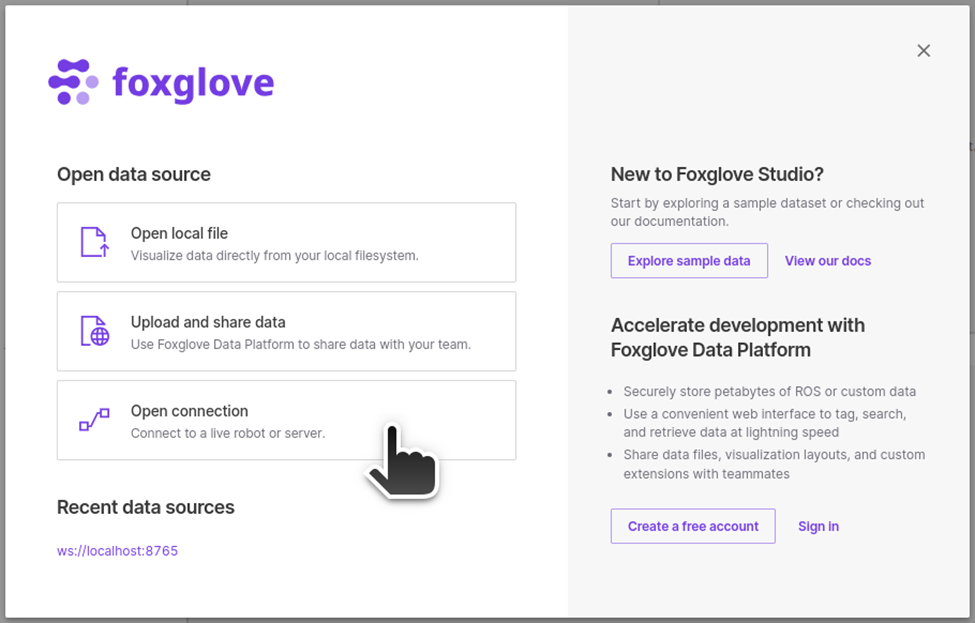

        Select "**Foxglove WebSocket**", leave the **WebSocket URL** as `ws://localhost:8765` and click on "**Open**".

        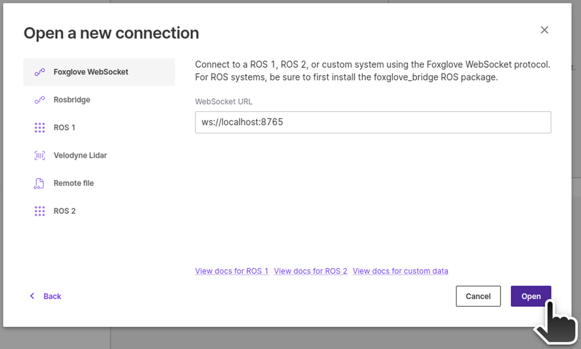

    4. Add teleop widget and set the topic to be `/cmd_vel`.
 
        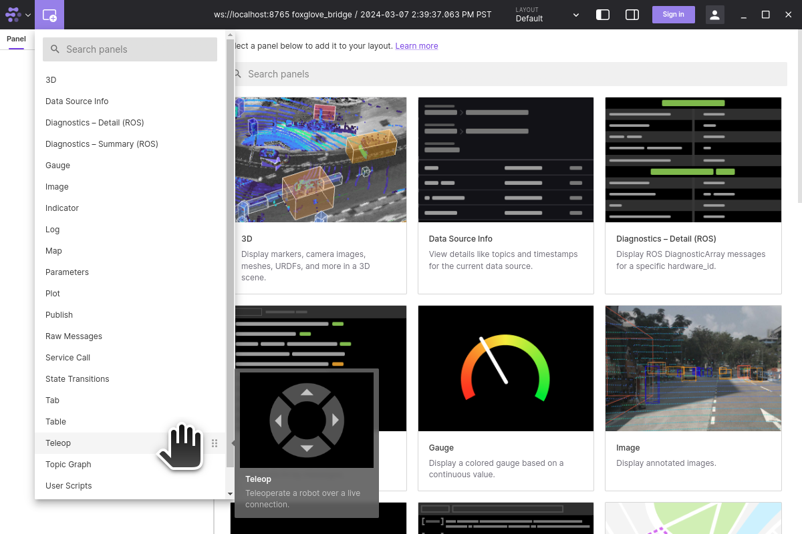
        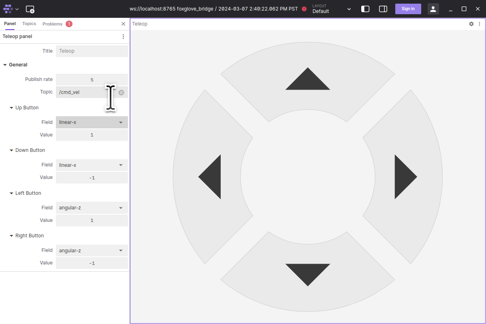

    5. Once Foxglove is ready, on Isaac Sim, hit "**Play**" button.

    6. Perform teleop to verify Action Graph for driving robot
   
    [Next](./isaac-sim_05.md){ .md-button .md-button--primary }


