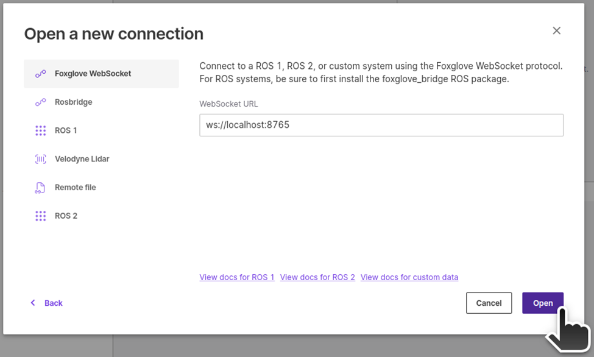

# Exercise 1.5 Build Action Graph for robot camera

!!! note ""

    :fontawesome-solid-book:{ .book-blue-note } *Documentation - [Link](https://docs.omniverse.nvidia.com/isaacsim/latest/ros2_tutorials/tutorial_ros2_drive_turtlebot.html#putting-it-together)*

!!! Warning "Cheat-file (course_env_5.usd)"

    You can access a pre-populated environment at `/home/nvidia/Desktop/Isaac_ROS_Isaac_SIM_[DLIT61534]/Isaac Sim Assets Pack 1/Assets/Isaac/2023.1.1/Isaac/Environments/Simple_Warehouse/course_env_5.usd`

    

## Step 1. Open Visual Scripting

Go to **Window** > **Visual Scripting** > **Action Graph**.


## Step 2. Create new Action Graph

Click on the **New Action Graph** icon in the middle of the **Action Graph** window.


## Step 3. Build graph

Search the relevant nodes in the search bar and build the graph shown below.


### Action Graph components

- **[On Playback Tick Node](https://docs.omniverse.nvidia.com/extensions/latest/ext_omnigraph/node-library/nodes/omni-graph-action/onplaybacktick-1.html?highlight=On%20Playback%20Tick%20Node#on-playback-tick)**: Generates a tick during simulation playback, ensuring nodes execute their functions every simulation step.
- [**Constant String**](https://docs.omniverse.nvidia.com/extensions/latest/ext_omnigraph/node-library/nodes/omni-graph-nodes/constantstring-1.html?highlight=Constant%20String#constantstring): Holds a string constant value
- **[Isaac Create Render Product](https://docs.omniverse.nvidia.com/extensions/latest/ext_omnigraph/node-library/nodes/omni-isaac-core_nodes/isaaccreaterenderproduct-2.html?highlight=Isaac%20Create%20Render%20Product#isaac-create-render-product)**: Isaac Sim node that creates a render product for use with offscreen rendering
- **[ROS2 Camera Helper](https://docs.omniverse.nvidia.com/extensions/latest/ext_omnigraph/node-library/nodes/omni-isaac-ros2_bridge-humble/ros2camerahelper-2.html?highlight=ROS2%20Camera%20Helper#ros2-camera-helper)**: This node handles automation of the camera sensor pipeline

!!! note

    For clarity, you can visually divide the graph into two sections: one for the left camera and the other for the right camera, as depicted in the image below.

    

## Step 4. Set the node properties

1. [Optional] Assign ROS DOMAIN ID if needed using **ROS2 Context Node**.

    

2. Assign the left camera Prim to render camera data in the first **Isaac Create Render Product** Node.

    

    Select the target for left camera

    

    After selecting the target, cameraPrim parameter will be populate with this path for the left camera:

    - `/World/turtlebot3_burger/base_scan/rsd455/RSD455/Camera_OmniVision_OV9782_Left`

3. Assign the right camera Prim to render camera data in the second **Isaac Create Render Product** Node.

    

    Select the target for right camera

    

    After selecting the target, cameraPrim parameter will be populate with this path for the right camera:

    - `/World/turtlebot3_burger/base_scan/rsd455/RSD455/Camera_OmniVision_OV9782_Right`

    

4. Set the input value of the first **Constant String** node as the left camera name - "Camera_OmniVision_OV9782_Left"

    

5. Set the input value of the second **Constant String** node as the right camera name - "Camera_OmniVision_OV9782_Right"

    

6. Set the topicName and data type for each ROS2 Camera Helper Node. In this example, we'll utilize two topics (camera_info and rgb) for each camera (left and right), requiring a total of 4 ROS2 Camera Helper Nodes as depicted above.  Set the topics for each ROS2 camera node as follows:

    === "node 1"

        - topicName : `/front/stereo_camera/left/camera_info`
        - type : `camera_info`

        

    === "node 2"

        - topicName : `/front/stereo_camera/left/rgb`
        - type : `rgb`

        

    === "node 3"

        - topicName : `/front/stereo_camera/right/camera_info`
        - type : `camera_info`

        

    === "node 4"

        - topicName : `/front/stereo_camera/right/rgb`
        - type : `rgb`

        
        

!!! info

    If you plan to continue working on the later exercise using the environment you have been working on, save the environment file by selecting **File** > **Save As...** or ++ctrl+shift+s++. 
    

!!! tip

    In case you run into OOM (out of memory) issue, you should try lowering the camera rendering resolution.
    
    For each **Isaac Create Render Product** node,  lower the values for `height` and `width` in Inputs pane.

    

    Make sure to perform this for both nodes, one for the left camera, one for the right camera.


## Step 5. Play

Click "**Play**" icon

## Step 6. Verification

Verify the Action Graph by viewing the simulated world through robots cameras using ROS 2.

   
=== "RViz2"

    Open a terminal and source ros2 

    ```bash
    source /opt/ros/humble/setup.bash
    ```

    Open RViz2 to visualize the output from the camera

    ```bash
    rviz2
    ```

    1. Once the RViz window opens, click on "**Add**."

        

    2. Select "**Image**" and hit "**OK**" to visualize the output

        

    3. Choose the appropriate ROS2 topic to display its output on the selected display.<br>In our case it would be `/front/stereo_camera/right/rgb` or `/front/stereo_camera/left/rgb`

        

    <iframe src="https://drive.google.com/file/d/1wVos4xQL6gMF7347n7tbNYP1BCv9KV2B/preview" width="960" height="480" allow="autoplay"></iframe>
    
    [Next](../docs/../isaac-ros.md){ .md-button .md-button--primary }

=== "Foxglove"

    1. Start the Foxglove Bridge

        ```bash
        ros2 launch foxglove_bridge foxglove_bridge_launch.xml
        ```

    2. Then start the Foxglove Studio from GUI or CUI.

        ```bash
        foxglove-studio
        ```

    3. Click on "**Open connection**"

        

        Select "**Foxglove WebSocket**", leave the **WebSocket URL** as `ws://localhost:8765` and click on "**Open**".

        

    4. Layout
 
        Import the layout config file we provide, so you have all the widgets needed to control the robot with the camera feeds.<br>
        Open `foxglove_fpv_layout.json` in **home** directory.

        

    5. Once Foxglove is ready, on Isaac Sim, hit "**Play**" button.

    6. Perform teleop with video feeds to verify both Action Graphs
   
        You should be able to control the robot using the teleop widget while viewing the images from robot cameras in Foxglove.

    <iframe src="https://drive.google.com/file/d/1MTdF5NmBfBImGVSsQxGCoS-5JxuV3Xgx/preview" width="960" height="480" allow="autoplay"></iframe>

    [Next](../docs/../isaac-ros.md){ .md-button .md-button--primary }