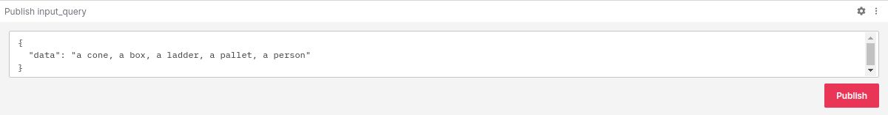

# Next-gen AI Integration

## ROS2 NanoOWL

### OWL-ViT
OWL-ViT (Vision Transformer for Open-World Localization) is an open-vocabulary object detection network trained on (image, text) pairs. It is used to query an image with text queries to detect target objects described in text. Learn more about OWL-ViT - [Link](https://huggingface.co/docs/transformers/model_doc/owlvit)

### NanoOWL
NanoOWL is a project that optimizes OWL-ViT for real-time inference on [Jetson Orin](https://store.nvidia.com/en-us/jetson/store) platforms with [NVIDIA TensorRT](https://developer.nvidia.com/tensorrt). Visit the [NanoOWL project](https://github.com/NVIDIA-AI-IOT/nanoowl) for more information.


[ROS2-NanoOWL](https://github.com/NVIDIA-AI-IOT/ROS2-NanoOWL) is a ROS 2 node for open-vocabulary object detection using NanoOWL. We will be running this ros2_nanoowl node on the Jetson from our Isaac ROS development environment. It will detect objects in Isaac Sim based on text queries that we will provide from Foxglove. 

## Setup
Detailed setup instructions - [Link](https://github.com/NVIDIA-AI-IOT/ROS2-NanoOWL/tree/master?tab=readme-ov-file#setup).

By this point in the session, we have already set up the Isaac ROS development environment. We’ll be using the same setup for running ROS2-NanoOWL. Some additional packages are required, which we have already made available in your ROS workspace:

- ROS2-NanoOWL
- nanoowl
- torch2trt
- torchvision
- tensorrt
- transformers
- demos (for cam2image)

We need the TensorRT engine for the OWL-ViT vision encoder. This step takes a few minutes and needs to be done on the target hardware (Jetson in our case). We’ve made this engine file available already in the data folder under ROS2-NanoOWL.

## Running with webcam
Let’s put the webcam to some use and try detecting objects around us! 

[ :simple-windowsterminal:{ .nvdarkgreen } Terminal 1 ] Launch the ros2_nanoowl node:
```bash
ros2 launch ros2_nanoowl camera_input_example.launch.py thresholds:=0.1 image_encoder_engine:='src/ROS2-NanoOWL/data/owl_image_encoder_patch32.engine'
```
Specify the desired detection threshold (in the thresholds parameter) and the path to your encoder engine (in the image_encoder_engine parameter).

[ :simple-windowsterminal:{ .nvdarkgreen } Terminal 2 ] Open a new terminal and run the container:
```bash
cd ${ISAAC_ROS_WS}/src/isaac_ros_common && \
./scripts/run_dev.sh ${ISAAC_ROS_WS}
```
Once in the Isaac ROS dev container, again source the workspace:

```bash
source /workspaces/isaac_ros-dev/install/setup.bash
```
Publish your input query:
```bash
ros2 topic pub /input_query std_msgs/String 'data: a person, a box, a forklift'
```

[ :simple-windowsterminal:{ .nvdarkgreen } Terminal 3 ] Open a new terminal and run the RViz:
```bash
rviz2
```
<!-- Publish a query from the Foxglove publish panel (Foxglove setup instructions [here](https://jetson.gitlab-master-pages.nvidia.com/isaac-sim-jetson-hil-course-doc/setup_pc.html)). Remember to click the Publish button everytime you update your query! Observe output detections on topic **/output_image**. 

 -->

## Running with Isaac Sim
Check that images from Isaac Sim are being published on topic **/front/stereo_camera/left/rgb** using the command below. We’ll perform detection on these images:
```bash
ros2 topic echo /front/stereo_camera/left/rgb
```

Launch the ros2_nanoowl node:
```bash
ros2 launch ros2_nanoowl nano_owl_example.launch.py thresholds:=0.1 image_encoder_engine:='src/ROS2-NanoOWL/data/owl_image_encoder_patch32.engine'
```

Specify the desired detection threshold (in the thresholds parameter) and the path to your encoder engine (in the image_encoder_engine parameter).

Publish a query from the Foxglove publish panel (Foxglove setup instructions [here](https://jetson.gitlab-master-pages.nvidia.com/isaac-sim-jetson-hil-course-doc/setup_pc.html)). Remember to click the Publish button everytime you update your query! Observe output detections on topic **/output_image**. 


!!! info

     A modification has been made to the launch file from the ROS2-NanoOWL GitHub for this session. The input image name has been remapped so that the ros2_nanoowl node subscribes to images from Isaac Sim on topic **/front/stereo_camera/left/rgb** instead of **/input_image**. This change is on line 45 of [nano_owl_example.launch.py](https://github.com/NVIDIA-AI-IOT/ROS2-NanoOWL/blob/master/launch/nano_owl_example.launch.py):
     
     - remappings=[('input_image', '/front/stereo_camera/left/rgb')]
 