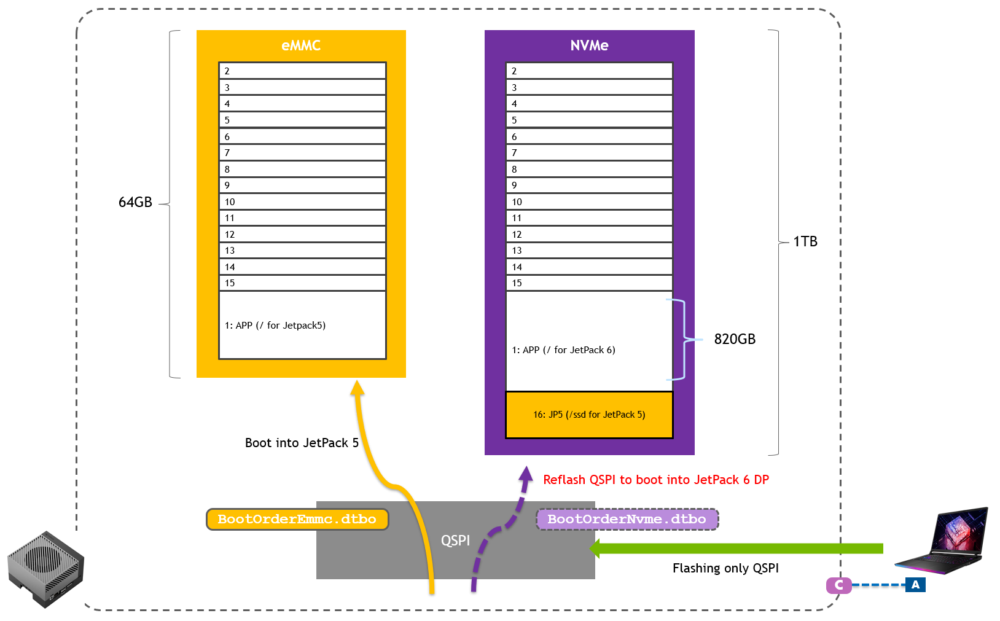
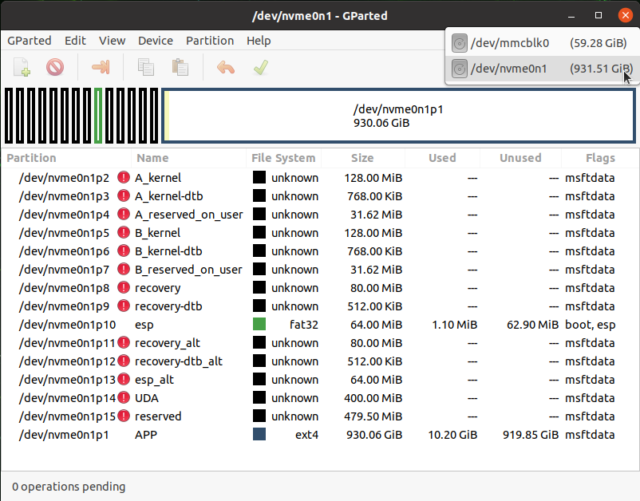
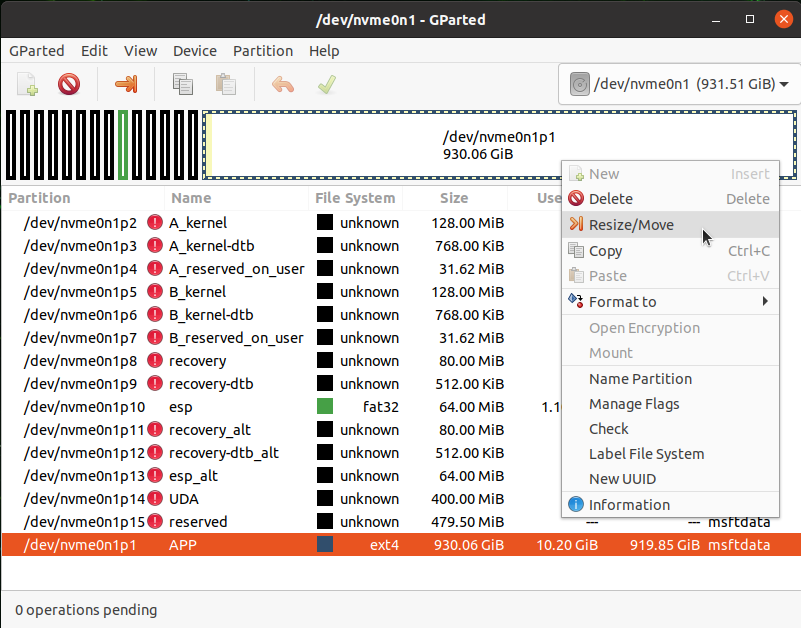
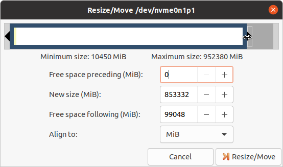
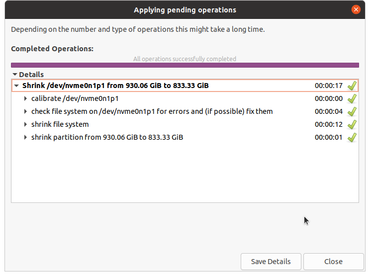
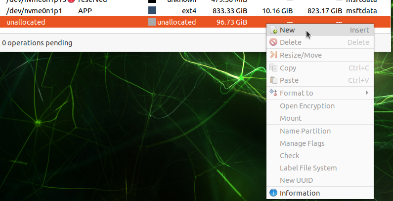
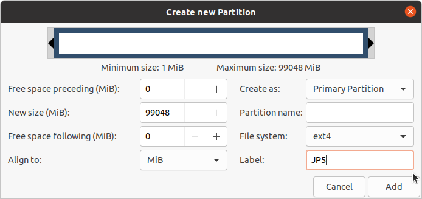
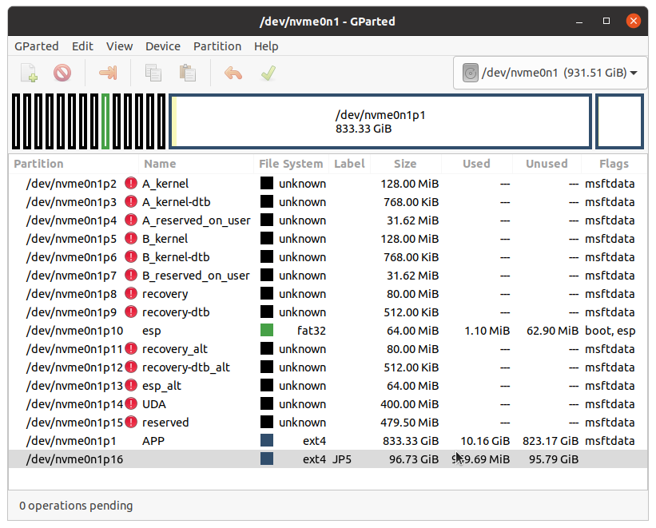

# Jetson Setup

This page documents how the Jetson used in the lab was set up prior to the course by instructors.

People can reference this page to learn how their own Jetson can be set up in order to follow the contents of this course by their own.

## Jetson hardware

For our course at the GTC 24, **Jetson AGX Orin 64GB Developer Kit** was used, partially because of the requirement of other courses that share the same lab room.<br>
One *could* use other Orin generation Jetson, such as Jetson Orin Nano Developer Kit, however it has not been fully verified.

!!! info ""

    For learning what Jetson developer kits are available and the order information, please check the [Jetson Developer Kits page on NVIDIA.com](https://developer.nvidia.com/embedded/jetson-developer-kits).

## Install JetPack 5.1.2

For this hands-on course, we run Isaac ROS 2.1 (the most up-to-date at the time of GTC 24) on Jetson, which requires JetPack 5.1.2.

Jetson AGX Orin 64GB Developer Kit shall be flashed using a host Linux PC, following the steps below.

```bash
cd
mkdir L4T_r35.4.1
cd L4T_r35.4.1
wget https://developer.nvidia.com/downloads/embedded/l4t/r35_release_v4.1/release/jetson_linux_r35.4.1_aarch64.tbz2
wget https://developer.nvidia.com/downloads/embedded/l4t/r35_release_v4.1/release/tegra_linux_sample-root-filesystem_r35.4.1_aarch64.tbz2
tar xf jetson_linux_r35.4.1_aarch64.tbz2
sudo tar xpf tegra_linux_sample-root-filesystem_r35.4.1_aarch64.tbz2 -C Linux_for_Tegra/rootfs/
cd Linux_for_Tegra/
sudo ./apply_binaries.sh
sudo ./tools/l4t_flash_prerequisites.sh
sudo ./flash.sh jetson-agx-orin-devkit internal
```

!!! info "Special "Dual boot" setup"

    ### Special case: Dual-boot with JetPack 6.0 DP

    Depending on the event's / other labs' needs, you may need to have another version of JetPack on the different storage medium on Jetson, in order to realize a "dual-boot" setup.

    We explain the additional instructions for such special setup using a folded adomonition like following.

    ??? info "Installing JetPack 6.0 DP on NVMe"
    
        After installing JetPack 5.1.2 on eMMC, you can perform the following to install JetPack 6.0 DP on NVMe.

        ```bash
        cd ~/L4T_r36.2/Linux_for_Tegra
        sudo ./nvsdkmanager_flash.sh --storage nvme0n1p1
        ```

        This will re-write the contents on QSPI bootloader, so Jetson is configure to boot into JetPack 6.0 DP from NVMe, although the eMMC is left in tact with the JetPack 5.1.2 contents.

        Populating the `~/L4T_r36.2/Linux_for_Tegra` directory process is like following.

        ```bash
        cd
        mkdir L4T_r36.2
        cd L4T_r36.2
        wget https://developer.nvidia.com/downloads/embedded/l4t/r36_release_v2.0/release/jetson_linux_r36.2.0_aarch64.tbz2
        wget https://developer.nvidia.com/downloads/embedded/l4t/r36_release_v2.0/release/tegra_linux_sample-root-filesystem_r36.2.0_aarch64.tbz2
        tar xf jetson_linux_r36.2.0_aarch64.tbz2
        sudo tar xpf tegra_linux_sample-root-filesystem_r36.2.0_aarch64.tbz2 -C Linux_for_Tegra/rootfs/
        cd Linux_for_Tegra/
        sudo ./apply_binaries.sh
        sudo ./tools/l4t_flash_prerequisites.sh
        ```

    In later section, we explain how to switch JetPack 5 (booting from eMMC) and JetPack 6 DP (booting from NVMe) by re-flashing QSPI NOR flash memory containing the bootloader and the DTB overlay, and how we can set up an additional partition on NVMe SSD for JetPack 5.

    


??? info "Re-flashing QSPI to switch between JP5 :material-arrow-left-right: JP6"

    ### Switching between JP5 :material-arrow-left-right: JP6

    === "Switching to JP 5.1.2"

        Once you have installed JetPack 5 on eMMC and JetPack 6 DP on NVMe, you can issue the following commands on the attached Linux PC to re-flash the QSPI to configure Jetson **to boot into JetPack 5**.

        First, put Jetson into Forced Recovery mode by pressing `Reset` button (next to the LED) while holding `Forced Recovery` button (middle).

        !!! caution

            On the PC, make sure to download `jetson-agx-orin-devkit-qspi.conf` from [here](../assets/jetson-agx-orin-devkit-qspi.conf) and save under `Linux_for_Tegra` directory first.

        ```bash
        cd ~/L4T_r35.4.1/Linux_for_Tegra
        sudo ADDITIONAL_DTB_OVERLAY="BootOrderEmmc.dtbo" ./flash.sh jetson-agx-orin-devkit-qspi mmcblk0p1
        ```
        
        Flashing process will take about 8 minutes.

    === "Switching to JP 6.0 DP"

        Once you have installed JetPack 5 on eMMC and JetPack 6 DP on NVMe, you can issue the following commands on the attached Linux PC to re-flash the QSPI to configure Jetson **to boot into JetPack 6 DP**.

        First, put Jetson into Forced Recovery mode by pressing `Reset` button (next to the LED) while holding `Forced Recovery` button (middle).

        ```bash
        cd ~/L4T_r36.2/Linux_for_Tegra
        sudo ADDITIONAL_DTB_OVERLAY="BootOrderNvme.dtbo" ./flash.sh p3737-0000-p3701-0000-qspi nvme0n1p1
        ```
        
        Flashing process will take about 8 minutes.

### SSD setup

Follow [this instruction on Isaac ROS Doc](https://nvidia-isaac-ros.github.io/getting_started/hardware_setup/compute/jetson_storage.html#ssd-setup) to auto-mount SSD and set up Docker directory on SSD.

Only when you have a special need to configure your Jetson to have a "dual boot" configuration with other version of JetPack like for the labs at GTC 24, follow the steps below.

??? info "Setting up an additional partition on existing NVMe"

    ### In case NVMe already populated by JetPack 6.0 DP

    #### GParted

    First install `gparted`.

    ```
    sudo apt install -y gparted
    ```

    Start `gparted` and select `/dev/nvme0n1`

    

    Select the largest partition `**APP**`, and from the context menu select "**Resize/Move**"

    

    Shrink the current APP partition to create about **`99,000 MiB`** of free space, and hit **Resize/Move** button.

    

    Back on the main window, press the green checkmark icon (✔) to start the partition resizing operation.<br>
    Click "**Apply**" on the confirmation dialog.

    It takes 10-20 seconds and you will see the operation successfully completed like this.

    

    Right-click on "**unallocated**" partition from the list and select "**New**" from the context menu.

    

    Enter "JP5" or something in "**Label**" for easy identification, and click "**Add**".

    

    Back on the main window, press the green checkmark icon (✔) to start the partition creation operation.<br>

    Click "**Apply**" on the confirmation dialog, and the operation should be completed in a second.

    

    You should see the new **`/dev/nvme0n1p16`** created in the list.

    

    You can close `gparted` application.

    #### Terminal operation

    Once everything is done with GParted, open a new terminal to perform the following.

    ```bash
    sudo mkfs.ext4 /dev/nvme0n1p16
    sudo mkdir /ssd
    sudo mount /dev/nvme0n1p16 /ssd
    echo "/dev/nvme0n1p16 /ssd/ ext4 defaults 0 2" | sudo tee -a /etc/fstab
    cat /etc/fstab
    df -h
    ```

    Make sure you see `/dev/nvm0n1p16` of about 95GB mounted on `/ssd`.

    Go through the rest of the Docker directory setup on [this doc](https://nvidia-isaac-ros.github.io/getting_started/hardware_setup/compute/jetson_storage.html#migrate-docker-directory-to-ssd).

    Remember 

## Isaac ROS setup

!!! note ""

    :fontawesome-solid-book:{ .book-blue-note } *Official Isaac ROS Documentation - [Computer Setup - Jetson Platforms](https://nvidia-isaac-ros.github.io/getting_started/hardware_setup/compute/index.html#jetson-platforms)*

Install the whole JetPack (or only install docker and VPI?).

```bash
sudo apt update
sudo apt install -y nvidia-jetpack
```

Rest of the setup.

```bash
cat /etc/nv_tegra_release
sudo /usr/sbin/nvpmodel -m 0
sudo usermod -aG docker $USER
newgrp docker

# Add Docker's official GPG key:
sudo apt-get update
sudo apt-get install ca-certificates curl gnupg
sudo install -m 0755 -d /etc/apt/keyrings
curl -fsSL https://download.docker.com/linux/ubuntu/gpg | sudo gpg --dearmor -o /etc/apt/keyrings/docker.gpg
sudo chmod a+r /etc/apt/keyrings/docker.gpg

# Add the repository to Apt sources:
echo \
"deb [arch="$(dpkg --print-architecture)" signed-by=/etc/apt/keyrings/docker.gpg] https://download.docker.com/linux/ubuntu \
"$(. /etc/os-release && echo "$VERSION_CODENAME")" stable" | \
sudo tee /etc/apt/sources.list.d/docker.list > /dev/null
sudo apt-get update

sudo apt install docker-buildx-plugin
```

Isaac ROS container image pull and build.

```bash
sudo systemctl daemon-reload && sudo systemctl restart docker
sudo apt-get install git-lfs
git lfs install --skip-repo
mkdir -p  /ssd/workspaces/isaac_ros-dev/src
echo "export ISAAC_ROS_WS=/ssd/workspaces/isaac_ros-dev/" >> ~/.bashrc
source ~/.bashrc
cd ${ISAAC_ROS_WS}/src
mkdir src
git clone https://github.com/NVIDIA-ISAAC-ROS/isaac_ros_common.git
cd ${ISAAC_ROS_WS}/src/isaac_ros_common
./scripts/run_dev.sh ${ISAAC_ROS_WS}
```

## Nvblox setup

!!! note ""

    :fontawesome-solid-book:{ .book-blue-note } *Official Isaac ROS Documentation - [**`isaac_ros_nvblox` - Quickstart**](https://nvidia-isaac-ros.github.io/repositories_and_packages/isaac_ros_nvblox/isaac_ros_nvblox/index.html#quickstart)*


```bash
cd ${ISAAC_ROS_WS}/src
git clone --recurse-submodules https://github.com/NVIDIA-ISAAC-ROS/isaac_ros_nvblox.git && \
    cd isaac_ros_nvblox && git lfs pull
cd ${ISAAC_ROS_WS}/src/isaac_ros_nvblox && \
  git lfs pull -X "" -I "nvblox_ros/test/test_cases/rosbags/nvblox_pol"
cd ${ISAAC_ROS_WS}/src/isaac_ros_common && \
  ./scripts/run_dev.sh ${ISAAC_ROS_WS}
```

Inside the container,

```bash
cd /workspaces/isaac_ros-dev/ && \
    rosdep install -i -r --from-paths src --rosdistro humble -y --skip-keys "libopencv-dev libopencv-contrib-dev libopencv-imgproc-dev python-opencv python3-opencv nvblox"
cd /workspaces/isaac_ros-dev && \
  colcon build --symlink-install && \
  source install/setup.bash
```

## Docker container image mod and swap


## Clone JetPack 5.1.2 

### Capturing the image

First, connect the source (original) Jetson unit to the Linux PC and put Jetson into Forced Recovery mode.

Issue the following to extract the APP partition image and save it as `gtc-jp5.img` on your PC.

```bash
sudo ./flash.sh -r -k APP -G gtc-jp5.img jetson-agx-orin-devkit mmcblk0p1
```

!!! attention

    In case you ended up having an empty `gtc-jp5.img` file:

    ```bash
    $ ls -lh gtc-0311-jp5.img
    -rwxr-xr-x 1 root root 0 Mar 11 14:14 gtc-0311-jp5.img
    ```

    Here is a work-around to convert the `.img.raw` file to `.img` file.

    ```bash
    cp gtc-0311-jp5.img.raw system2.img.raw
    losetup -f system2.img.raw
    losetup
    sudo resize2fs /dev/loop16 55G
    sudo truncate system2.img.raw --size 59055800320
    sudo apt install img2simg
    sudo img2simg system2.img.raw gtc-0311-jp5.img
    ls -lh gtc-0311-jp5.img
    rm system2.img.raw
    ```

### Flashing with the image

!!! info

    If you are using a new PC to set for flashing, go through the follwoings.

    ```bash
    cd
    mkdir L4T_r35.4.1
    cd L4T_r35.4.1
    wget https://developer.nvidia.com/downloads/embedded/l4t/r35_release_v4.1/release/jetson_linux_r35.4.1_aarch64.tbz2
    wget https://developer.nvidia.com/downloads/embedded/l4t/r35_release_v4.1/release/tegra_linux_sample-root-filesystem_r35.4.1_aarch64.tbz2
    tar xf jetson_linux_r35.4.1_aarch64.tbz2
    sudo tar xpf tegra_linux_sample-root-filesystem_r35.4.1_aarch64.tbz2 -C Linux_for_Tegra/rootfs/
    cd Linux_for_Tegra/
    sudo ./apply_binaries.sh
    sudo ./tools/l4t_flash_prerequisites.sh
    ```

    And copy the following files from the PC used to capture the image.

    - `gtc-jp5.img`
    - `bootloader/esp.img`

    ```bash
    scp nnnn@10.110.50.120:/home/nnnn/L4T_r35.4.1/Linux_for_Tegra/gtc-jp5.img ./
    scp nnnn@10.110.50.120:/home/nnnn/L4T_r35.4.1/Linux_for_Tegra/bootloader/esp.img ./bootloader
    ```

Before flashing a new unit using this image, edit `./bootloader/t186ref/cfg/flash_t234_qspi_sdmmc.xml` so that `APP` section has `<allocation_attribute>` to be `0x808` instead of the original `0x8`.

The APP section should look like the following:

```xml
<partition name="APP" id="1" type="data">
    <allocation_policy> sequential </allocation_policy>
    <filesystem_type> basic </filesystem_type>
    <size> APPSIZE </size>
    <file_system_attribute> 0 </file_system_attribute>
    <allocation_attribute> 0x808 </allocation_attribute>
    <align_boundary> 16384 </align_boundary>
    <percent_reserved> 0 </percent_reserved>
    <unique_guid> APPUUID </unique_guid>
    <filename> APPFILE </filename>
    <description> **Required.** Contains the rootfs. This partition must be assigned
        the "1" for id as it is physically put to the end of the device, so that it
        can be accessed as the fixed known special device `/dev/mmcblk0p1`. </description>
</partition>
```

Then connect the target unit to Linux PC, put it into Forced Recovery mode to flash the Jetson with your image.

```bash
sudo cp gtc-jp5.img bootloader/system.img
sudo ADDITIONAL_DTB_OVERLAY="BootOrderEmmc.dtbo" ./flash.sh -r jetson-agx-orin-devkit mmcblk0p1
```


## Jetson misc setup

### Stop auto screen blanking 

```bash
gsettings set org.gnome.desktop.session idle-delay 0
```

After that you can double-check on GUI by going "**Settings**" > "**Power**" > "**Power Saving Options**" to check "**Screen Black**" to have been set to "**Never**".

