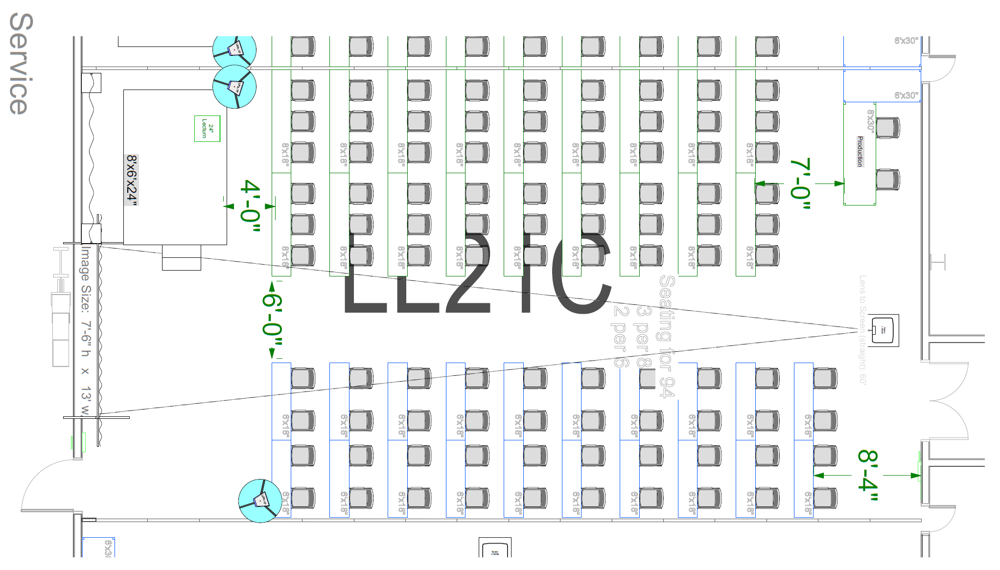

# Lab Setup

This page documents how things are set up / prepared prior to the course by instructors and stuff.

## Site setup

### Lab room setup

### Table setup

<iframe src="https://docs.google.com/presentation/d/e/2PACX-1vQYJNoDKez4B08FYrq0yZuIgUH3x8ezXn56jq4dbO6shfBxcofJF27EdZTb5kLIMBB141JfstkUhMF7/embed?start=false&loop=false&delayms=3000" frameborder="0" width="960" height="462" allowfullscreen="true" mozallowfullscreen="true" webkitallowfullscreen="true"></iframe>

