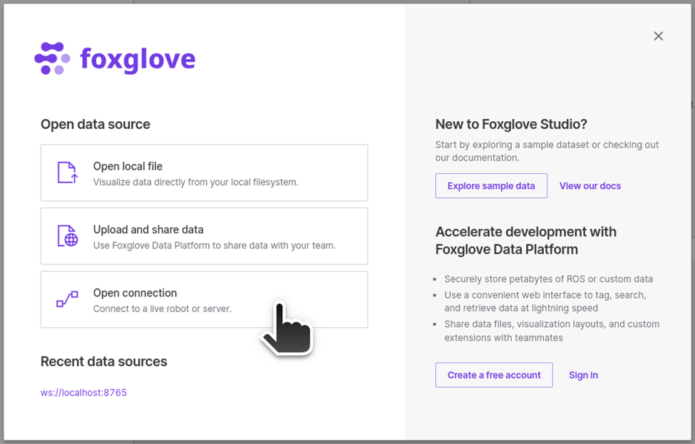

# Linux PC setup

## Ubuntu setup

- Install Ubuntu 22.04

## Install NVIDIA driver

!!! note ""

    :fontawesome-solid-book:{ .book-blue-note } *Official Isaac ROS Documentation - [**Isaac Sim Driver Requirements**](https://docs.omniverse.nvidia.com/isaacsim/latest/installation/requirements.html#isaac-sim-driver-requirements)*


```
sudo apt-get install nvidia-driver-525
```

## Isaac Sim setup

### Install Omniverse Launcher

Download Omniverse Launcher

- [Link for Linux](https://install.launcher.omniverse.nvidia.com/installers/omniverse-launcher-linux.AppImage)

Install Omnivese Launcher

```bash
sudo apt install libfuse2
chmod +x ./omniverse-launcher-linux.AppImage
./omniverse-launcher-linux.AppImage
```

### Install Isaac Sim

!!! note ""

    :fontawesome-solid-book:{ .book-blue-note } *Official Isaac ROS Documentation - [**Workstation Installation**](https://docs.omniverse.nvidia.com/isaacsim/latest/installation/install_workstation.html#isaac-sim-setup-native-workstation-launcher)*


Install **Release 2023.1.1**.


## Foxglove setup

### Install Foxglove

Download and install.

```bash
wget https://get.foxglove.dev/desktop/latest/foxglove-studio-1.87.0-linux-amd64.deb
sudo apt install ./foxglove-studio-*.deb
```

Install the ROS bridge

```bash
source /opt/ros/
sudo apt install ros-$ROS_DISTRO-foxglove-bridge
```

### Save pre-made layout config locally

Start the Foxglove Bridge

```bash
ros2 launch foxglove_bridge foxglove_bridge_launch.xml
```

Then start the Foxglove Studio from GUI or CUI.

```bash
foxglove-studio
```

Click on "**Open connection**"



Select "**Foxglove WebSocket**", leave the **WebSocket URL** as `ws://localhost:8765` and click on "**Open**".


For viewing the camera images published, and controlling the robot by publishing `/cmd_vel` messages, you can setup a layout like this to enable "*FPV tele-operation*".


Save the layout config to a local file for use later.<br>
Click the **Foxglove icon** at the top left corner, select **View** > **Export layout to file** ....


Name it `foxglove_fpv_layout.json` or something appropriate and save it under the home directory.